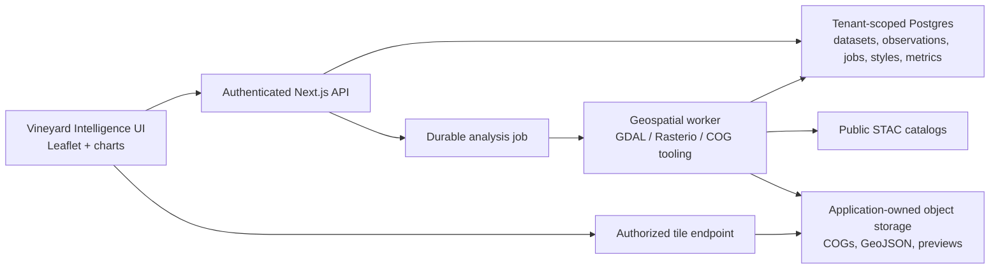

# Vineyard Intelligence discovery brief

**Date:** 2026-07-23
**Status:** Product discovery and implementation brief; not an approved implementation plan
**Repository:** `C:\Users\russe\Documents\Wine-inventory`
**Reference product:** a leading precision-viticulture product (identity and access details in the external research note)
**Audience:** An LLM or engineer investigating, planning, and implementing comparable vineyard GIS,
statistics, field-measurement, and satellite-analysis features in Wine-inventory.

## 1. What we are trying to build

Build a first-class **Vineyard Intelligence** product area inside Wine-inventory. It should combine:

- Existing vineyard and block records
- Existing editable block polygons and satellite maps
- Sentinel-2 NDVI and related imagery
- Spatially located vineyard observations
- Statistical summaries and charts
- Interpolation and management-zone analysis
- Sampling-grid generation
- Field notes, scouting, harvest, and vineyard work-order follow-up

This is not intended to be a pixel-for-pixel clone of the reference product or a disconnected generic
GIS laboratory. The product job is:

> Show a vineyard manager where conditions differ inside a vineyard, how those patterns are changing,
> how satellite patterns compare with field measurements, and where someone should scout or act.

The initial release should make NDVI genuinely useful. Later releases should map and analyze pruning
weight, cluster weight, Brix, nutrient results, soil observations, yield components, and other
spatially sampled vineyard measurements.

## 2. Product principles established in discovery

1. **Relative patterns matter.** The default NDVI color scale should be calibrated to the selected
   vineyard, not forced into one broad static scale that hides meaningful within-vineyard variation.
2. **Absolute meaning must remain available.** Relative scaling can make a uniformly weak vineyard
   look colorful. Users must be able to switch to an absolute or historically locked scale.
3. **The user controls the legend.** Users should be able to select a palette, reverse it, set the
   minimum and maximum, and define color stops.
4. **A smooth-looking map must remain honest.** Sentinel-2 NDVI has 10 m source pixels. Visual
   resampling can soften the blocky appearance, but must never be presented as higher-resolution
   measurement.
5. **Raw data is never discarded.** Smoothed or interpolated products are derivatives with recorded
   parameters. Raw pixels and raw field observations remain available.
6. **Trends beat snapshots.** A scene should be part of a time series with acquisition date, quality,
   and comparison context.
7. **Maps support decisions, not diagnoses.** Low NDVI or a nutrient cluster should prompt scouting;
   it should not claim a disease, nutrient deficiency, or irrigation cause without ground truth.
8. **All outputs are reproducible.** Every map records input data, formula, masking, scale, smoothing,
   classification, CRS, algorithm version, and date.
9. **The vineyard model stays central.** GIS does not create a second farm/block identity system.
10. **Tenant isolation is non-negotiable.** Geometry, observations, jobs, imagery, statistics, tiles,
    exports, and saved styles are tenant scoped.
11. **Planting geometry and management geometry are different.** A continuous planted footprint is
    the imagery/analysis mask; blocks are labeled management units inside it.
12. **Boundary pixels are fractional, not binary.** A pixel intersected by a planting or block
    boundary is retained with an intersection fraction for statistics and clipped visually at the
    exact vector boundary.

### 2.1 Required spatial hierarchy

Use the following hierarchy:

```text
Vineyard
  ├─ site identity, name, grower, general location, shared metadata
  ├─ Planting Area 1
  │    ├─ canonical polygon/multipolygon for one continuous planting
  │    ├─ Block A
  │    └─ Block B
  └─ Planting Area 2
       └─ Block C
```

Recommended product term: **Planting area**. Recommended internal provisional name:
`VineyardPlantingArea`.

- A vineyard is the named farm/site and may contain multiple spatially disconnected plantings.
- A planting area represents one continuous set of planted rows and is the canonical parent analysis
  mask. It is not the property parcel and should not bridge woods, lakes, roads, buildings, or large
  unplanted gaps merely to create one polygon.
- A block is an agronomic/management unit inside a planting area, commonly distinguished by variety,
  clone, rootstock, year planted, row spacing, irrigation, or management intent.
- A subblock remains an optional operational division inside a block. If subblocks later participate
  in spatial analysis, they also need governed geometry rather than only a code/label.
- One accepted Sentinel scene and one vineyard-level color domain can cover all planting areas,
  preserving a cohesive comparison even when the plantings are geographically disconnected.

The live Russian River Ranch example illustrates this distinction: its two drawn block polygons are
separate plantings divided by substantial non-vine land. They should remain under one named vineyard
but should not be connected by an invented outer polygon.

### 2.2 Recommended setup workflow

The first-time workflow should be map-first and hierarchical:

1. Create/select the vineyard and establish its general location.
2. Draw or import each continuous planting area. Allow holes for meaningful non-vine features.
3. Name the planting area if there is more than one, for example `North Planting` or `Home Ranch`.
4. Choose one of:
   - `This planting is one block`, which creates a block from the whole planting geometry.
   - `Split into blocks`, which partitions the planting using shared-boundary split tools.
   - `Draw blocks inside`, with snapping to the planting boundary and existing block edges.
5. Enter block labels and metadata after the spatial units are visible.
6. Run a topology review showing overlaps, gaps, slivers, blocks outside the planting, and unassigned
   planted area.
7. Confirm the canonical analysis mask and block partition before requesting satellite processing.

Prefer split/partition tools over independently drawing every touching polygon. Independent drawing
creates small overlaps and gaps that later double-count or omit area. Allow intentional unassigned
planting area, but show it explicitly rather than silently losing it.

Existing users must not redraw everything:

1. Union existing block polygons.
2. Group unioned shapes by spatial continuity into proposed planting areas.
3. Preserve the original block polygons and metadata unchanged.
4. Show proposed planting areas for review, naming, hole correction, and confirmation.
5. Record provenance that the parent was derived from existing blocks.

### 2.3 Geometry invariants

- Planting and block geometry supports GeoJSON `Polygon` and `MultiPolygon`.
- Geometry is stored canonically in WGS84 but processed in a suitable projected CRS for area,
  buffering, intersection, and topology checks.
- Every block must reference one planting area.
- A block should be fully covered by its parent planting within a documented coordinate tolerance.
- Sibling blocks should not overlap. Shared edges should snap to the same coordinates.
- Gaps are allowed only as visible `unassigned` planting area or explicit excluded holes.
- Editing a planting boundary must trigger a review of blocks, sampling points, saved statistics,
  and derived products affected by the change.
- Geometry versions and effective dates are required so a replant or boundary correction does not
  silently rewrite historical analysis.

### 2.4 Sentinel boundary pixels and fractional coverage

Avoid both common binary errors:

- **Pixel-center only:** drops a pixel when its center lies outside even if much of the pixel is
  planted.
- **All touched as full weight:** counts a pixel equally when 1% or 100% is inside.

For every intersecting source pixel `i`, calculate:

```text
coverageFraction[i] =
  area(sourcePixel[i] intersection analysisPolygon)
  / area(sourcePixel[i])
```

Keep all positive intersections. For a numeric raster value `v[i]`, the default boundary-aware mean
is:

```text
weightedMean =
  sum(v[i] * coverageFraction[i])
  / sum(coverageFraction[i])
```

Use coverage-weighted distributions/quantiles where supported, and report both physical covered area
and effective pixel count (`sum(coverageFraction)`). Do not describe a 0.12-covered pixel as one full
vineyard pixel.

For display, clip the raster/tile alpha mask to the exact planting or block polygon at display
resolution. The boundary can therefore cut through a colored Sentinel cell without discarding that
cell. Bilinear resampling remains a display choice and must not determine inclusion or statistics.

Important scientific limitation: the NDVI value still describes the full native 10-by-10 m Sentinel
pixel. Clipping or giving a pixel 0.12 weight does not reveal the NDVI of only the 12% inside the
vineyard. Boundary pixels may contain mixed vines, roads, soil, or neighboring vegetation. Preserve
their coverage fraction, expose an optional minimum-coverage sensitivity filter, and flag small or
narrow blocks where boundary/mixed pixels dominate.

Use an exact fractional zonal-statistics implementation rather than ordinary raster-center masking.
The [`exactextract` documentation](https://isciences.github.io/exactextract/background.html)
describes fractional cell coverage, and current
[GDAL zonal-statistics documentation](https://gdal.org/en/stable/programs/gdal_raster_zonal_stats.html)
likewise supports fractionally weighted pixels. GDAL `ALL_TOUCHED` is acceptable for finding
candidate/display cells but is insufficient by itself for weighted statistics.

## 3. Evidence from the reference product

The inspected production deployment publicly served a JavaScript source map containing original Vue
source in `sourcesContent`.

- Reference page: `(see the external research note)`
- Source map inspected:
  `(see the external research note)`
- Inspection date: 2026-07-23
- Source-map entries: 563
- Unique normalized first-party `src/*` paths found: 146

The bundle hash can change. If this source-map URL disappears, inspect the deployed HTML/runtime for
the current `app.<hash>.js`, then inspect its `sourceMappingURL` or corresponding `.js.map`.

### 3.1 What the source map exposes

- Map rendering and dataset visualization
- Categorical and continuous color styling
- Equal-interval and Jenks classification
- Heatmaps, filters, point sizing, labels, and block overlays
- Statistical formulas and chart recipes
- Browser-side raster sampling
- Dataset coordinate joining
- Client-side K-means clustering
- UTM-aligned grid generation and sampling strategies
- Satellite STAC search and scene normalization
- NDVI and other spectral-index formulas
- Job payloads, progress UI, and public backend function names

### 3.2 What it does not expose

- Actual server-side IDW implementation
- `processSatelliteDataset` internals
- `runAnalysisRecipe` internals
- `processMagicMap` internals
- Exact backend raster clipping, masking, fishnet creation, temporal aggregation, storage, and
  authorization

The frontend provides strong evidence about intended behavior and interfaces. Frontend comments about
backend behavior remain claims to validate.

### 3.3 Safe investigation rules

The requester states that the reference product is their website. Even so:

- Reimplement standard formulas, public GIS algorithms, public STAC interfaces, and observed product
  behavior.
- Confirm ownership/licensing before directly copying substantial source bodies.
- Never copy exposed tokens, API keys, production identifiers, Firebase configuration, credentials,
  or signed URLs.
- Do not call, load-test, or depend on the reference product production Cloud Functions.
- Keep source-map investigation read-only.
- Redact token-bearing lines from notes and reports.

### 3.4 Source-map extraction

The map contains loader-decorated duplicates. Normalize source paths and retain the longest
`sourcesContent` entry for each normalized path:

```powershell
$mapUrl = '(see the external research note)'
$map = ((Invoke-WebRequest -UseBasicParsing $mapUrl -TimeoutSec 60).Content |
  ConvertFrom-Json)

$firstParty = @{}
for ($i = 0; $i -lt $map.sources.Count; $i++) {
  $path = ($map.sources[$i] `
    -replace '^webpack:///[.]?/', '' `
    -replace '^webpack:///', '' `
    -replace '\?.*$', '')
  $text = [string]$map.sourcesContent[$i]

  if ($path -like 'src/*' -and (
    -not $firstParty.ContainsKey($path) -or
    $text.Length -gt $firstParty[$path].Length
  )) {
    $firstParty[$path] = $text
  }
}

$firstParty.Keys | Sort-Object
```

Do not save the entire extracted third-party source tree in this repository. Record paths,
observations, small pseudocode, and implementation contracts.

## 4. Reference source index

These are embedded source-map paths, not files in Wine-inventory.

### 4.1 Mapping and dataset tools

| Reference path | Investigation value |
| --- | --- |
| `src/store/mapActions.js` | Main Mapbox lifecycle, GeoJSON/raster loading, layer creation, classifications, filters, size interpolation, heatmaps, block overlays, and custom raster base layers. |
| `src/components/dataset/DatasetVizSettings.vue` | Color ramps, classifications, zone counts, labels, filters, point sizing, and heatmap controls. |
| `src/components/dataset/DatasetFilters.vue` | Filter semantics and UI. |
| `src/components/dataset/DatasetDetails.vue` | Metadata, summary/export behavior, concave hulls, and zone statistics. |
| `src/components/dataset/MagicMap.vue` | Block selection and backend-orchestrated mapped/interpolated dataset output. |
| `src/components/dataset/BulkUploadModal.vue` | Upload formats, validation, metadata, and dataset document shape. |
| `src/components/dataset/DatasetList.vue` | Dataset/folder mental model. |
| `src/components/farm/KeyStats.vue` | Histogram range filtering and basic statistics connected to the map. |

Observed visualization methods:

- Point, line, polygon, multipolygon, and raster layers
- Solid color
- Continuous/linear numeric interpolation
- Equal-interval zones
- Jenks natural breaks through `turf-jenks`
- Categorical match expressions
- Numeric point sizing
- Weighted heatmaps
- Numeric range filters
- Configurable class count and colors

### 4.2 Statistics and charts

| Reference path | Investigation value |
| --- | --- |
| `src/components/plugins/figures/services/StatsService.js` | Exact client statistical formulas. |
| `src/components/plugins/figures/services/ChartService.js` | Chart recipes, aggregations, regressions, correlation, and exports. |
| `src/components/plugins/figures/components/PlotConfigurator.vue` | Analysis controls. |
| `src/components/plugins/figures/components/ChartDisplay.vue` | Rendering and export UX. |
| `src/components/plugins/figures/components/DatasetBrowser.vue` | Dataset/column selection. |
| `src/components/plugins/figures/components/FigureRecipes.vue` | User-facing recipes. |
| `src/components/plugins/figures/Figures.vue` | Top-level workflow. |

Observed statistics:

- Mean, sum, min, max, range, and count
- Population and sample variance/standard deviation
- Median
- Type-7/R-default linearly interpolated quantiles
- p10, p25, p75, p90, and IQR
- Pearson correlation
- Ordinary least-squares regression
- Freedman-Diaconis histogram bins with square-root fallback
- Gaussian KDE with Silverman bandwidth
- 1.5-IQR boxplot outlier fences
- Numeric/date/text inference

Observed charts:

- Scatter with regression
- Line and time series
- Bar and grouped bar with reducers
- Histogram with KDE
- Boxplot and outliers
- Density view
- Pearson correlation matrix
- Pie/donut
- PNG, CSV, statistics CSV, and JSON exports

### 4.3 Spatial-analysis tools

| Reference path | Investigation value |
| --- | --- |
| `src/components/plugins/raster-analysis/RasterAnalysis.vue` | GeoBlaze pixel lookup, neighborhood mean, Turf bounds, and Proj4 reprojection. |
| `src/components/plugins/interpolator/Interpolator.vue` | IDW request payload, progress watch, and result creation. |
| `src/components/plugins/grid-generator/store/actions.js` | Even/random/stratified grids, distance-to-edge rules, and box sampling. |
| `src/components/plugins/grid-generator/Options.vue` | Grid options and product language. |
| `src/lib/universalMergician.js` | UTM-aligned universal grids and zone-boundary handling. |
| `src/components/collector/CreateCollector.vue` | Point, line, and polygon collector modes and GPS-versus-map-tap product language. |
| `src/components/collector/Collector.vue` | GPS capture, reported accuracy thresholds, manual-map fallback, and saved observation geometry. |
| `src/store/actions.js` | Mapbox geolocation control, high-accuracy tracking, and selected map-location state. |
| `src/components/plugins/multivariate/store/mutations.js` | Coordinate joins and feature vectors. |
| `src/components/plugins/multivariate/store/actions.js` | Browser-side `node-kmeans` and cluster output. |
| `src/components/plugins/data-joiner/ChooseDatasets.vue` | Coordinate-based joins and merged headers. |
| `src/components/plugins/VariableRateMode.vue` | Voronoi zone generation, polygon union, zone rates, and point-in-zone lookup. |

Observed raster sampling:

1. Load a GeoTIFF.
2. Load point GeoJSON.
3. Reproject WGS84 coordinates into the raster CRS when needed.
4. Read a single pixel with `geoblaze.identify`, or calculate a neighborhood mean with
   `geoblaze.mean`.
5. Attach the result to point features.
6. save/download a new GeoJSON dataset.

Observed IDW boundary:

- The UI calls it inverse-distance weighting.
- The request includes source dataset, numeric field, filters, selected blocks, and
  `resolution: 3`.
- A Firestore request document is watched for completion and a download path.
- Power, neighbor count, search radius, CRS, no-data policy, and actual interpolation code are not
  exposed.

Observed K-means:

- Coordinate-joined rows become vectors.
- `node-kmeans` runs with user-selected `k`.
- Cluster membership is written to GeoJSON.
- Normalization is not evident. Wine-inventory must not cluster mixed-unit raw values without a
  scaling policy.

Observed grids:

- Random points within polygons
- Even grids by distance or count-derived spacing
- UTM grid alignment
- UTM-zone detection
- Point-in-polygon trimming
- Distance-to-edge avoidance
- Stratification by mapped zones
- Box/window sampling with zone-pixel and coverage requirements

Observed field collection:

- A browser/phone Mapbox geolocation control requests high-accuracy, continuously tracked location.
- A point collector can use the current GPS location or a location manually selected on the map.
- The saved point contains latitude, longitude, and the browser-reported accuracy when GPS is used.
- The collector labels accuracy of more than 5 m as bad, more than 3 m through 5 m as okay, and
  3 m or less as good.
- Collectors can define custom fields and can collect point, line, or polygon geometry.
- The exposed client does not reveal a complete sample-route workflow that orders target points,
  navigates to the next point, records arrival offset, and marks points collected/skipped.

Observed grid-generator choices:

- Build from an existing dataset, random points across blocks, or evenly spaced points.
- Even spacing can be defined by point count or distance; the UI exposes 1, 3, 5, 10, 30, and 100 m
  distance choices.
- Dataset-based sampling can be non-stratified, stratified, or manually configured.
- Stratified sampling supports random, even, and compact box/window distribution.
- The inspected defaults are 25 even-grid points, 3 m spacing, 5 points per zone, and a 3-by-3 box.
- The box choices are 3-by-3, 5-by-5, and 7-by-7 native raster cells, with an avoid-edges option.
- The box UI cites Trivedi et al. (2025), discussed in Section 9.5.

### 4.4 Satellite and index tools

| Reference path | Investigation value |
| --- | --- |
| `src/components/plugins/satellite/services/SatelliteImageryService.js` | STAC catalogs, collection routing, search, scene normalization, asset signing, and band/index availability. |
| `src/components/plugins/satellite/SatelliteImagery.vue` | Search, preview, raster tile routing, and dataset job submission. |
| `src/components/plugins/satellite/SatellitePanel.vue` | Parallel/newer panel implementation; compare before treating either as canonical. |
| `src/components/plugins/satellite/components/SceneSelectionModal.vue` | Collection/date/cloud/scene UX. |
| `src/components/plugins/satellite/components/DatasetPreviewModal.vue` | Formula definitions, required bands, output products, and raster versus vector-fishnet output. |
| `src/components/plugins/satellite/components/AnalysesTab.vue` | Temporal recipe, progress stages, cloud-filter promise, and job payload. |
| `src/components/plugins/satellite/components/BlockSelectionPanel.vue` | Block selection. |
| `src/components/plugins/satellite/services/MapService.js` | Raster and block layers. |
| `src/components/plugins/satellite/services/BlockService.js` | Block retrieval/normalization. |
| `src/components/plugins/satellite/components/Aviris3Tab.vue` | Optional hyperspectral research, not MVP. |

Observed catalogs include:

- Element84 Earth Search for Sentinel-2 L2A
- Microsoft Planetary Computer for Sentinel-1 RTC, Landsat Collection 2 L2, MODIS vegetation
  indices, HLS, and ancillary products
- NASA CMR-STAC and specialized collections

Observed satellite workflow:

1. Search by block bounding box and date range.
2. Search multiple collections.
3. Apply an optical scene cloud prefilter.
4. Normalize asset names across collections.
5. Sign Planetary Computer COG assets.
6. Preview COGs through TiTiler/provider tile APIs.
7. Configure spectral outputs.
8. Submit an authenticated backend processing job.

Wine-inventory should move STAC access, signing, and normalization to the server. The browser should
receive application DTOs and authorized tile URLs.

## 5. Spectral formulas exposed by the reference

| Product | Formula | Sentinel-2 inputs |
| --- | --- | --- |
| NDVI | `(NIR - Red) / (NIR + Red)` | B08 and B04 |
| EVI | `2.5 * (B08 - B04) / (B08 + 6*B04 - 7.5*B02 + 1)` | B08, B04, B02 |
| NDRE | `(B08 - B05) / (B08 + B05)` | B08 and B05 |
| SAVI | `1.5 * (B08 - B04) / (B08 + B04 + 0.5)` | B08 and B04 |
| GNDVI | `(B08 - B03) / (B08 + B03)` | B08 and B03 |
| NDWI | `(B03 - B08) / (B03 + B08)` | B03 and B08 |
| MSI | `B08 / B11` | B08 and B11 |
| NDSI as labeled by the reference | `(B03 - B11) / (B03 + B11)` | B03 and B11 |
| Sentinel-1 VV dB | `10 * log10(VV)` | VV |
| Sentinel-1 VH dB | `10 * log10(VH)` | VH |
| Radar Vegetation Index | `(4 * VH) / (VV + VH)` | VV and VH |
| Cross-polarization ratio | `VH / VV` | VV and VH |

Authoritative NDVI numeric policy:

```text
denominator = nir + red
if red or nir is no-data, quality-masked, or abs(denominator) < epsilon:
    output = no-data
else:
    output = clamp((nir - red) / denominator, -1, 1)
```

Do not silently add epsilon everywhere. Explicit no-data behavior is easier to test and explain.

## 6. Required NDVI color calibration

This requirement is more specific than the original discovery brief and must be designed as a
first-class product feature.

### 6.1 Default: vineyard-relative robust calibration

The default single-scene view should use all valid NDVI pixels inside the **selected vineyard**
boundary, not separate scaling per block.

Recommended default domain:

- Low endpoint: vineyard p5
- High endpoint: vineyard p95
- Values below p5 clamp to the lowest color
- Values above p95 clamp to the highest color
- All blocks in that vineyard use the same domain

Why:

- It reveals lower- and higher-vigor areas within that vineyard.
- Robust percentiles stop a few outliers/noisy pixels from flattening the useful color variation.
- Vineyard-wide scaling preserves comparison between blocks.

Do not independently rescale each block. That would make two blocks with different absolute vigor
look falsely equivalent.

### 6.2 Required scale modes

The user must be able to switch between:

1. **Relative — this vineyard/current scene**
   - Robust percentile domain from the current accepted scene.
   - Best for within-vineyard scouting.
2. **Relative — selected block**
   - Optional focused inspection mode.
   - Must be labeled clearly and never used for cross-block comparison.
3. **Locked comparison scale**
   - One domain calculated from the union of all scenes/blocks in the comparison.
   - Required for side-by-side dates and animations.
4. **Season/vineyard baseline**
   - Domain calculated from a saved date window or baseline season.
   - Useful for tracking departures without colors shifting on every date.
5. **Absolute NDVI**
   - Fixed user/system domain, for example a configured subset of `[-1, 1]`.
   - Required for cross-vineyard and cross-year interpretation.
6. **Custom**
   - User chooses min, max, optional midpoint, class count, colors, and stop values.

The UI and exports must record the active scale mode. A legend without its calibration mode is
incomplete.

### 6.3 Palettes

Ship several presets:

- **Vigor classic:** deep red → orange → yellow → light green → dark green
- **Purple to green:** deep purple → lavender/neutral → light green → dark green
- **Color-vision-safe:** a perceptually ordered palette that does not rely only on red versus green
- **Discrete zones:** 3–7 user-selected class colors
- **Custom:** editable color stops, add/remove stop, reverse ramp, and save preset

The user should be able to make either purple or red the low end, choose a different high-end color,
and reverse the ramp. Every preset still needs numeric labels.

Saved style scope:

- One-off map style
- Saved vineyard preset
- Optional tenant-wide preset
- System default

Suggested configuration:

```ts
type ColorScaleMode =
  | "VINEYARD_SCENE"
  | "BLOCK_SCENE"
  | "COMPARISON_LOCKED"
  | "VINEYARD_BASELINE"
  | "ABSOLUTE"
  | "CUSTOM";

type ColorStop = { value: number; color: string };

type ColorScaleConfig = {
  metric: string;
  mode: ColorScaleMode;
  paletteId: string;
  reverse: boolean;
  percentileLow?: number;
  percentileHigh?: number;
  domainMin?: number;
  domainMax?: number;
  midpoint?: number;
  stops?: ColorStop[];
  clamp: boolean;
  noDataColor: string | null;
};
```

### 6.4 Avoid a relative-scale trap

A relative ramp always produces low and high colors, even when every pixel is similar or the whole
vineyard is unusually weak. Therefore show:

- Actual numeric domain
- Vineyard mean/median
- Absolute NDVI reference
- Distribution/histogram
- Spread indicator such as IQR or standard deviation
- Warning when the relative domain is extremely narrow

For nutrient analyses, a relative ramp may be inappropriate. Support an agronomic-target mode with
user-defined low/acceptable/high thresholds and a diverging palette centered on the target band.

## 7. Required Sentinel-2 smoothing and resampling

Sentinel-2 B04 and B08 have 10 m source pixels. A 10 m pixel is real source resolution. Resampling
the display to 2 m or drawing a smooth gradient does not create 2 m information.

The product should support smoothing, with raw and derived behavior kept separate.

### 7.1 Display resampling

This changes appearance only:

- **Nearest neighbor:** preserves visible source pixels
- **Bilinear:** recommended default display; smooths tile appearance
- **Cubic:** optional presentation mode; can overshoot and must be tested

Display-resampled tiles must not be used to calculate statistics. The UI can default to bilinear so
the map does not look like large hard-edged squares.

### 7.2 Analytical spatial smoothing

Optional derived layers:

- 3×3 median filter for salt-and-pepper/noisy pixels
- 3×3 focal mean or Gaussian filter
- 5×5 filters only with an explicit warning about stronger spatial blurring
- Edge-aware masking so pixels outside a block or vineyard do not bleed into the vineyard

At 10 m resolution:

- 3×3 considers roughly a 30 m neighborhood
- 5×5 considers roughly a 50 m neighborhood

These may blur small blocks, headlands, row-edge effects, and narrow vigor patterns. Parameters must
be visible and saved.

### 7.3 Temporal smoothing

Often preferable to aggressive spatial smoothing:

- Median composite of several acceptable scenes in a short date window
- Rolling median of block statistics
- Optional trend line over raw scene points

Temporal composites reduce transient atmospheric/noise effects but sacrifice single-date specificity.
The map must say “composite” and show its date window and accepted scene count.

### 7.4 Required raw/smoothed contract

- Preserve raw masked NDVI.
- Raw-pixel block statistics are the default authoritative statistics.
- Store a smoothed raster only as a derivative.
- Let users toggle `Raw pixels`, `Smooth display`, and `Smoothed analytical layer`.
- Show method, kernel, resampling, and source resolution.
- Never label smoothed output “higher resolution.”
- Avoid ML super-resolution in the first releases; it can invent convincing spatial detail.

Recommended Release 1:

1. Raw masked 10 m NDVI for analysis.
2. Bilinear tile rendering by default.
3. Nearest-neighbor toggle to inspect source pixels.
4. Optional 3×3 median or Gaussian analytical layer, clearly labeled.
5. Short-window temporal median composite after single-scene NDVI is stable.

## 8. Temporal-analysis behavior

The reference exposes a temporal recipe with:

- Sentinel-2 NDVI and Sentinel-1 VH sources
- Date range
- Mean, median, max, min, standard deviation, and valid-observation count
- Block and farm
- Generated job ID
- Firestore job progress
- `runAnalysisRecipe` backend request

Its UI describes this cloud policy:

1. Coarse scene-wide prefilter (`cloudCoverMax: 70` appeared in the inspected frontend).
2. Inspect Sentinel-2 SCL classification over the actual block.
3. Exclude a scene if more than 5% of block pixels are cloud, cloud shadow, or cirrus.

The 5% detail is a frontend promise, not verified backend code. Validate the actual SCL classes,
dilation around clouds, no-data behavior, and threshold during the processing spike.

## 9. Spatial field measurements

The product must support spatial mapping of:

- Pruning weight
- Cluster weight
- Berry weight when available
- Cluster count
- Shoot count/canopy observations
- Brix
- pH and TA where sampled spatially
- Petiole, blade, soil, or other nutrient analyses
- Yield observations
- Soil moisture and other sensor/manual readings
- User-defined numeric observations

### 9.1 Coordinates are required for within-block maps

Existing block-level Brix records can produce a block time series but not a within-block surface.
To map variation inside a block, each observation needs one of:

- GPS latitude/longitude captured at sampling
- A persistent sampling-point ID with saved geometry
- A row/vine location resolvable to geometry
- A generated sampling-grid cell ID

Do not fabricate point locations by placing block-level readings at a centroid.

### 9.2 Recommended observation model

Use a generic spatial observation model rather than one new table per measurement:

```text
VineyardObservation
  tenantId
  id
  vineyardId
  blockId
  samplePointId?
  observedAt
  season/vintageYear?
  source: MANUAL | CSV | LAB_IMPORT | SENSOR | DERIVED
  geometry: GeoJSON Point
  sampleCode?
  notes?
  createdBy / createdAt

VineyardObservationValue
  tenantId
  observationId
  analyte/metric key
  numericValue
  unit
  qualifier?
  detectionLimit?
```

Exact schema names are provisional. Determine whether existing chemistry/analyte registries should
be reused for nutrient and Brix units.

### 9.3 Input workflows

- Mobile/manual entry with GPS
- CSV import with latitude and longitude
- CSV import keyed to saved sample points
- Generate a sampling grid, download/print it, and enter results against point IDs
- Lab-result import mapped to sample codes
- Phone-guided collection from a saved sampling grid
- Optional snapping of GPS readings to a saved sampling point
- Validation for units, duplicate samples, coordinate order, and points outside the selected block

The user should be able to keep an outside-block point with an explicit warning when GPS accuracy or
the saved boundary explains it.

### 9.4 Phone-guided collection workflow

the reference product confirms the basic interaction: a grower can collect a point using the phone's
browser GPS, see an accuracy assessment, or tap the map when GPS is unavailable or the desired
location differs. Wine-inventory should retain that simple path and add the missing connection
between a designed sample and the measurement collected in the field.

Required workflow:

1. Generate and save a sampling plan with stable point IDs such as `B12-2027-P07`.
2. Order points into a practical walking/driving route while allowing the user to choose any point.
3. Show the target, current phone position, estimated distance and bearing, and reported GPS accuracy.
4. Show accuracy as good/okay/poor. The the reference product thresholds can seed the interface, but
   must be presented as device accuracy, not a guarantee of survey-grade location.
5. Let the user mark arrived, collect measurements, attach notes/photos, skip, or reschedule.
6. Save both the planned point and actual captured point, GPS accuracy, distance from target,
   collector, timestamp, protocol, and sample/lab code.
7. Permit an explicit manual-map override and record that provenance.
8. Work in weak-connectivity conditions: cache the block, targets, form, and pending records, then
   synchronize safely without duplicating observations.
9. Retain permanent reference points/vines so measurements can be repeated in future seasons.

A starting arrival tolerance may be `max(5 m, 1.5 x reported GPS accuracy)`, with an explicit manual
override. This is a product heuristic to validate in field testing, not a published agronomic
threshold. Phone GPS should guide a person to a row segment; permanent vine tags or row/vine IDs
should identify the exact experimental unit when repeatability matters.

### 9.5 Sampling intent must be chosen before density

Do not present one universal "good/better/best" grid. First ask what the user needs:

1. **Representative block result:** estimate a block-level nutrient or vigor value efficiently.
2. **Zone comparison:** compare low, medium, and high vigor or other management zones.
3. **Continuous spatial map:** interpolate variation and quantify where the map is reliable.

The same 9 samples cannot honestly mean the same thing in all three workflows. The plan builder must
state its intended output and must not offer interpolation when the design only supports a composite
block result.

### 9.6 Recommended Good / Better / Best plans

These are product starting points, not universal scientific laws. Block size, row spacing, terrain,
spatial autocorrelation, laboratory cost, metric, phenological stage, and management decision must
remain visible inputs.

#### Good: representative and fast

Use when the goal is a representative whole-block result rather than a within-block map.

- For tissue nutrients, offer a satellite-informed compact box, initially a 3-by-3 Sentinel-2
  window (approximately 30 by 30 m at native 10 m pixels), placed in a representative area and away
  from boundaries.
- Collect the laboratory-required number of blades or petioles across multiple vines within the
  box and combine them as one clearly identified composite sample.
- Oregon State guidance calls for 60-100 petioles or 20-40 leaf blades at bloom, or the same counts
  at veraison, while consistently revisiting representative rows/areas and separately sampling
  problem areas.
- For dormant pruning weights, start with at least 20 vines distributed among 3-5 areas, commonly
  5-10 consecutive vines per area, and preserve the same reference vines across years.
- Output: a defensible block/composite result and field record. Do not generate a continuous map.

The the reference product box option is grounded in
[Trivedi et al. (2025)](https://link.springer.com/article/10.1007/s11119-025-10225-5).
Across its trials, compact box sampling reduced sampling distance/time by approximately 74-75% and
represented several macronutrients well. The paper explicitly targets representative nutrient
distribution, not a spatial prediction map; performance was weaker for some highly variable
nutrient/stage combinations such as potassium at veraison and calcium. The interface must preserve
that limitation.

Do not confuse a 3-by-3 box of satellite pixels with nine leaves, nine vines, or nine laboratory
samples. The pixel window chooses a compact representative area; the crop-specific protocol still
determines how many vines and tissues are collected within it.

#### Better: zone-aware

Use when the user needs to compare meaningful portions of a block without paying for dense mapping.

- Build three initial strata from a seasonally appropriate NDVI composite, optionally combined with
  Sentinel-1 or stable multiyear information: low, medium, and high vigor/variability.
- Select approximately 3-5 well-separated locations per stratum, avoiding headlands and boundary
  pixels unless edge conditions are intentionally being studied. the reference product's inspected
  default is five points per zone.
- Keep measurements attributable to their zone. For tissue analysis, this normally means a separate
  composite and laboratory result per zone, each containing the protocol-required tissue count.
- For pruning weight, cluster weight, Brix, and repeat observations, keep permanent target IDs and
  revisit the same vines or row segments.
- Output: zone comparisons, summaries, and coarse management zones. Interpolation may be exploratory
  only and must display uncertainty/validation.

Research comparing vineyard sampling designs found that stratified sampling produced lower
interpolation error than a similarly dense regular grid, and that remote-sensing-assisted methods
improved prediction:
[Araya-Alman et al., IVES](https://ives-openscience.eu/36475/).

#### Best: map and validate

Use when the requested deliverable is a continuous spatial surface or a research-grade comparison.

- Begin with a stratified or systematic pilot grid aligned to rows and the expected spatial scale.
  A 15-20 m starting interval is reasonable for a serious small-block pilot, but it is not a fixed
  agronomic standard.
- For context, one published 3.4 ha vineyard study collected 90 samples on a 15 m grid, approximately
  26.5 locations/ha:
  [Bramley et al.](https://research.monash.edu/en/publications/within-vineyard-variability-in-grape-quality-and-yield-and-its-re/).
- Use a pilot of roughly 25-30 well-distributed points when block size permits, estimate spatial
  autocorrelation/variograms, cross-validate candidate interpolation settings, and add points in
  high-uncertainty or rapidly changing areas.
- Prefer stratification and regression kriging or another validated use of NDVI as an auxiliary
  variable when it materially lowers held-out error; never assume visual correlation is sufficient.
- Store point-level samples separately unless the analytical protocol explicitly defines a
  composite. Laboratory nutrient mapping may be too expensive to justify this tier.
- Output: a continuous map only after passing coverage and cross-validation checks, accompanied by
  sample locations, uncertainty/error metrics, parameters, and a warning against interpreting
  resampled pixels as new observations.

The best plan is therefore adaptive, not merely "the most points." Spatial range and held-out error
should determine whether more samples are needed. A smartphone-guided approach is feasible: recent
precision-viticulture research describes Sentinel-2-derived homogeneous zones and phone guidance to
representative sampling locations:
[Bahat et al.](https://onlinelibrary.wiley.com/doi/10.1155/ajgw/8612863).

### 9.7 Metric-specific protocol presets

The plan wizard must branch by metric:

| Metric | Default sampling unit | Critical controls | Appropriate outputs |
| --- | --- | --- | --- |
| Tissue nutrients | Composite of protocol-required blades/petioles | Tissue type, phenological stage, cultivar/rootstock, lab method, separate problem areas | Block result or zone comparison; dense mapping only when justified |
| Pruning weight | Tagged vine or fixed consecutive-vine segment | At least 20 vines/block starting point, same reference vines, mass/vine and shoot count | Vine balance, zone comparison, repeated spatial pattern |
| Cluster weight/count | Tagged vine/segment with defined cluster procedure | Sample timing, vine count, inclusion/exclusion rules | Yield components and zone comparison |
| Brix | Tagged vine/segment with a defined berry/cluster composite | Berry count, canopy side/exposure, sampling time, cultivar, phenology | Ripeness zones and repeated trends |
| Soil nutrients/moisture | Depth-specific point/composite | Depth, horizon, collection date, moisture state, lab method | Point/zone result or validated map |

See Oregon State's
[vineyard nutrition sampling guidance](https://extension.oregonstate.edu/crop-production/wine-grapes/monitoring-vineyard-nutrition)
and
[dormant pruning-weight protocol](https://extension.oregonstate.edu/catalog/em-9069-how-measure-dormant-pruning-weights-grapevines)
for the initial crop-protocol defaults. Administrators must be able to version protocols because
regional extension and laboratory requirements differ.

### 9.8 Sampling-plan acceptance criteria

Before a plan is generated, show:

- Intended inference: block mean, zone comparison, or continuous map
- Metric and experimental unit
- Estimated target count, tissue/fruit units per target, composites, and laboratory samples
- Estimated walking distance, field time, and lab cost
- Edge exclusion, minimum separation, route order, and replacement-point rules
- Satellite/date/composite used for stratification and its valid-pixel coverage
- Permanent versus one-time target designation
- What the completed plan can and cannot support

After collection, report planned/collected/skipped counts, actual-to-target offsets, GPS accuracy,
protocol deviations, spatial coverage, and whether the intended analysis remains valid.

### 9.9 Map options for each metric

- Raw points with labels/popups
- Proportional circles
- Heatmap
- Continuous color surface
- Equal-interval classes
- Jenks natural breaks
- Quantile classes
- Custom agronomic thresholds
- IDW interpolation
- Later: ordinary kriging if validation shows value over IDW
- Histogram, boxplot, summary, and time series

All units must be shown. Never join or compare `lb/vine` with `kg/vine`, or nutrient ppm with percent,
without canonical conversion.

## 10. Multivariate K-means and management zones

Yes, the intended product includes K-means zoning across variables such as pruning weight, cluster
weight, Brix, NDVI, and nutrient analytes.

It must be more statistically explicit than the exposed reference client.

### 10.1 Data preparation

1. Select vineyard/block, date/season window, and metrics.
2. Select a common spatial support:
   - Saved sampling points
   - Universal grid cells
   - Raster cells
   - Block/subblock polygons
3. Join observations with a visible distance/tolerance rule.
4. Aggregate repeated observations per location and time window.
5. Convert units.
6. Handle missing values explicitly.
7. Standardize each selected variable, normally z-scores.
8. Record all transformations.

Do not use exact floating-point coordinate equality as the only join strategy.

### 10.2 K-means requirements

- User-selected `k`, initially 2–7
- Optional recommended `k` using silhouette score or another documented diagnostic
- Deterministic random seed
- Standardization on by default
- Cluster sizes and standardized centroids
- Original-unit summaries for interpretation
- Neutral labels such as Zone 1/2/3 until the user names them
- Stable saved result with algorithm version
- Ability to inspect which measurements drove each zone

### 10.3 Spatial zone output

K-means clusters points; it does not create clean contiguous polygons automatically. A zone workflow
may:

1. Classify aligned grid points.
2. Convert cells to polygons.
3. Dissolve adjacent cells by cluster.
4. Remove/fold tiny slivers according to a recorded threshold.
5. Optionally smooth polygon boundaries for presentation.

Never change cluster membership merely to make a prettier polygon without recording the post-process.

### 10.4 Example agronomic workflows

- **Pruning weight alone:** map raw points, interpolate, classify low/medium/high, and generate next
  season's sampling zones.
- **Pruning weight + cluster weight:** standardize both, cluster into balance/vigor zones, and inspect
  crop-load ratios.
- **NDVI + Brix:** align the closest acceptable NDVI scene to sampling date, cluster standardized
  values, and identify areas where vigor and ripeness patterns diverge.
- **NDVI + nutrient panel:** join by sample point/grid cell, standardize analytes, cluster, then inspect
  zone centroids. Do not label a zone “deficient” unless user-defined agronomic thresholds support it.
- **Multiyear stability:** compare zone membership across seasons and flag persistent versus transient
  patterns.

## 11. What Wine-inventory already has

### 11.1 Existing map surface

- `src/app/(app)/vineyards/maps/page.tsx`
- `src/app/(app)/vineyards/maps/MapsClient.tsx`
- `src/components/ui/SatelliteMap.tsx`
- `src/components/ui/SatelliteMap.client.tsx`
- `src/components/ui/MapLegend.tsx`
- `src/lib/map/wayback.ts`
- `src/lib/map/google-tiles.ts`
- `src/lib/map/attribution-refresh.ts`

Current capabilities:

- Leaflet satellite map
- Keyless Esri imagery and optional Google tiles
- Leaflet-Geoman block drawing/editing/snapping
- Block overlays and click behavior
- Esri Wayback historical imagery
- Distance measurement
- PNG export
- WGS84 shapefile export

Keep this Leaflet foundation. Do not switch to Mapbox simply because the reference uses Mapbox.

### 11.2 Geometry and persistence

- `prisma/schema.prisma`
  - `Vineyard`
  - `VineyardDetail`
  - `VineyardBlock.polygon Json?`
  - `VineyardSubblock`
- `src/lib/vineyard/data.ts`
  - Pure serialization
- `src/lib/vineyard/actions.ts`
  - Polygon validation
  - 64 KiB limit
  - 2,000-vertex limit
  - Coordinate validation
  - Tenant transaction and audit
- `test/vineyard-data.test.ts`
  - GeoJSON serialization coverage

The current schema has no vineyard or planting-area polygon. It stores only
`VineyardBlock.polygon`, described as illustrative rather than the acreage source, and the current
setup independently draws each block. Vineyard Intelligence should:

1. Promote reviewed existing block polygons to canonical **block analysis boundaries**.
2. Add a separately governed parent planting-area geometry as specified in Section 2.
3. Derive proposed planting parents from existing block unions so current users do not redraw.
4. Keep spacing-based planted acreage as an agronomic estimate while also reporting polygon area
   separately; never silently replace one with the other.

### 11.3 Adjacent workflows

- Field notes: `src/app/(app)/vineyards/field-notes/`
- Harvest and Brix: `src/app/(app)/vineyards/harvest/`, `src/lib/harvest/`
- Vineyard actions: `src/lib/vineyard/`
- Planned vineyard work/activity engine: ROADMAP Phase 20
- Existing chart patterns:
  - `src/components/ui/BrixChart.tsx`
  - `src/components/ui/AnalyteTrendChart.tsx`
  - `src/lib/harvest/chart.ts`
- NRCS SSURGO design/spike notes: `TODOS.md`

### 11.4 Existing NRCS SSURGO soil design

Authoritative design input:

- External design:
  `C:\Users\russe\.rstack\projects\wine-inventory\russe-claude-usgs-soil-maps-vineyard-eabe6c-design-20260720-005928.md`
- In-repository backlog summary: `TODOS.md`, section
  `NRCS SSURGO soil composition per vineyard block`
- Status: designed and live-spike verified on 2026-07-20; not implemented.

The provider is USDA **NRCS**, not USGS. Web Soil Survey is the familiar user interface;
[Soil Data Access](https://sdmdataaccess.nrcs.usda.gov/WebServiceHelp.aspx) is the official
programmatic interface.

Load-bearing decisions from the design and spike:

- Query the existing canonical block polygon.
- Use one server-side SDA spatial query with `mupolygongeo.STIntersection(...)`, joined to `mapunit`
  and `muaggatt`; the spike observed 74-315 ms.
- Do not add Turf or PostGIS for this feature.
- Store a dated, versioned per-block snapshot rather than depending on a live response every time the
  map opens.
- Aggregate only clipped **area share**. Never invent a blended block pH, drainage class, available
  water capacity, or restrictive depth.
- Retain every displayed soil's `mukey`, map-unit name, source level/basis, properties, and share.
- Store and display coverage separately; fix the verified coverage tolerance at `0.005`.
- Treat water, pits, rock outcrop, urban land, area-not-surveyed, and other non-soil map units as
  distinct coverage classes, not as ordinary soils or silent gaps.
- Apply a documented minimum-share floor around 1% to prevent boundary slivers from appearing as
  meaningful soils. Decide explicitly whether sub-floor units are folded into `Other` or omitted.
- Preserve single-map-unit results as normal and valid.
- Limit SSURGO behavior to covered US areas; non-US vineyards receive a coherent unavailable state.
- Mark a snapshot stale when its source block polygon fingerprint changes, while retaining the prior
  snapshot for reproducibility.

This design complements the new planting hierarchy:

- Soil composition remains a **block** fact because the block is the management unit.
- A planting-area soil overview may sum block map-unit areas, but must not blend soil properties.
- The generic GIS map can show an optional soil overlay, while the stored composition snapshot
  remains the reliable block record.
- Changing a planting/block boundary invalidates relevant soil, Sentinel, sampling, and derived-layer
  products through the same geometry-version mechanism.

## 12. Recommended product scope

### Release 1A: planting geometry foundation

- Vineyard → planting area(s) → block hierarchy
- Draw/import continuous planting areas
- Create one block from a planting or split/snap a planting into blocks
- Topology validation for outside blocks, overlaps, gaps, slivers, and holes
- Reviewable migration from existing block polygons
- Geometry versioning and audit history

### Release 1B: planting and block NDVI intelligence

- Search/select acceptable Sentinel-2 L2A scenes
- Process one cohesive scene/raster over the union of the selected vineyard's planting areas
- Raw masked NDVI clipped to planting and block polygons
- Fractional boundary-pixel coverage for zonal statistics; no center-only pixel dropping
- Exact vector alpha clipping for display, including partial boundary cells
- Bilinear default display plus nearest-neighbor inspection
- Vineyard-relative p5–p95 color calibration by default
- Vigor classic, purple-to-green, color-vision-safe, and custom palettes
- Absolute, locked comparison, baseline, and custom scale modes
- Numeric legend, histogram, and scale-mode label
- Per-block min, p10, p25, median, mean, p75, p90, max, standard deviation, valid count/percentage
- Previous-scene comparison
- Block time series
- Optional clearly labeled 3×3 smoothing
- Field follow-up action
- CSV and provenance export

### Release 1C: NRCS soil documentation layer

- One-click, server-side SDA soil pull for a reviewed US block polygon
- Stored current snapshot plus retained superseded snapshots
- Covered/uncovered/anomalous area state
- Map-unit area share and polygon-derived area
- One property card per meaningful soil map unit with `mukey` and source basis
- No block-level property blending
- Explicit non-soil classification for water, pits, rock outcrop, urban land, and similar units
- Approximately 1% minimum-share treatment for boundary slivers
- Single-soil, no-polygon, stale-polygon, no-coverage, non-US, timeout, and unreadable-snapshot states
- Optional clipped soil-boundary overlay after a focused geometry/response-size spike
- NRCS attribution, survey version, pull date, polygon fingerprint, and audit history

### Release 2: spatial vineyard observations

- Generic observation and value model
- Goal-specific Good / Better / Best sampling-plan wizard
- Saved permanent sampling points, grids, protocols, routes, and lab/sample codes
- Phone-guided GPS collection with accuracy, arrival offset, map-tap override, and visited/skipped state
- Offline-tolerant field capture and safe synchronization
- CSV and lab-result imports
- Pruning/cluster weights, Brix, nutrients, and user-defined metrics
- Points, heatmaps, proportional symbols, classifications, and statistics
- Saved style/color presets

### Release 3: derived spatial analysis

- Raster-to-point sampling
- Neighborhood means
- Tolerance-based coordinate join
- UTM-aligned sampling grids
- Random and stratified sampling
- IDW with explicit parameters and validation
- Standardized deterministic K-means
- Dissolved management-zone polygons
- Cross-variable charts and exports

### Later

- NDRE, EVI, SAVI, GNDVI, NDWI, Sentinel-1
- Temporal composites and multiyear stability
- Kriging if validated
- Hyperspectral/AVIRIS
- Variable-rate prescription export

Hardware/device control is a separate liability and safety class and is not implied by map support.

## 13. Recommended architecture



### 13.1 Client

Extend or wrap `SatelliteMap` with a generalized overlay contract:

```ts
type MapOverlay =
  | {
      kind: "vector";
      id: string;
      data: GeoJSON.FeatureCollection;
      style: VectorStyle;
      legend: LegendModel;
    }
  | {
      kind: "raster";
      id: string;
      tileUrl: string;
      opacity: number;
      resampling: "nearest" | "bilinear" | "cubic";
      bounds?: [number, number, number, number];
      legend: LegendModel;
    };
```

The current simple map should become a governed layer stack, not a collection of unrelated map
screens:

1. Base imagery
2. Planting-area boundaries
3. Block/subblock boundaries and labels
4. Sentinel raw/smoothed vegetation-index rasters
5. NRCS soil map-unit overlay
6. Sampling plans and collected observation points
7. Interpolated field-measurement surfaces
8. K-means/management-zone polygons
9. Field notes, alerts, and follow-up locations

Every layer needs visible on/off state, order, opacity where applicable, legend, source/provenance,
acquisition/effective date, quality/stale state, and an inspect interaction. A selected block should
link map features to its soil composition, NDVI statistics, samples, and management-zone details.

Do not require all layers to share one persistence strategy:

- Sentinel is a versioned raster dataset.
- SSURGO composition is a stored block snapshot; an optional map-unit overlay is a vector display
  companion.
- Raw observations are durable points.
- Interpolations and clusters are reproducible derived datasets.

Keep statistical math and color-domain calculation in pure modules independent of React/Leaflet.

### 13.2 Worker

Heavy processing must not run in a normal Vercel request or in the browser.

Worker responsibilities:

- STAC search and normalization
- Provider signing
- COG reads
- Reprojection/alignment
- SCL/QA masking
- Band math
- Planting/block clipping with fractional pixel coverage
- Raw and smoothed derivatives
- Fractionally weighted zonal statistics
- Temporal aggregation
- Interpolation and clustering jobs
- Output COG/GeoJSON/preview generation

### 13.3 Storage

Postgres:

- Tenant ownership
- Datasets and provenance
- Observations and values
- Scenes
- Jobs and stages
- Block statistics
- Color/style configuration
- Analysis recipes

Object storage:

- Original uploads
- COGs and derived rasters
- Large GeoJSON
- Preview images
- Exports

Do not put GeoTIFF bytes in Postgres. Investigate existing `@vercel/blob` patterns and validate range
requests, egress, and asset authorization before selecting storage.

PostGIS is not required for Release 1. Add it when sustained indexed spatial joins/vector tiling
justify it, not merely because the feature is called GIS.

### 13.4 External APIs and recommended Sentinel provider

There is no need to purchase an NDVI-specific API. Use Sentinel-2 Level-2A surface reflectance and
calculate NDVI from B08 (near infrared) and B04 (red), while using SCL/data-mask information for
quality screening.

Recommended initial production integration:

1. **Copernicus Data Space Ecosystem STAC Catalog**
   - Endpoint: `https://stac.dataspace.copernicus.eu/v1/`
   - Collection: `sentinel-2-l2a`
   - Search by planting GeoJSON intersection, requested date window, and coarse cloud cover.
   - Official documentation:
     [CDSE STAC product catalogue](https://documentation.dataspace.copernicus.eu/APIs/STAC.html).
2. **Copernicus Sentinel Hub Process API**
   - Endpoint: `https://sh.dataspace.copernicus.eu/api/v1/process`
   - Request B04, B08, SCL/dataMask, or an NDVI GeoTIFF over the planting AOI.
   - It hides Sentinel tile boundaries and mosaics the requested area/time period.
   - Official documentation:
     [Process API](https://documentation.dataspace.copernicus.eu/APIs/SentinelHub/Process.html).
3. **OAuth2 client credentials**
   - Token endpoint:
     `https://identity.dataspace.copernicus.eu/auth/realms/CDSE/protocol/openid-connect/token`
   - Store the client ID/secret only in the server/worker secret store (`CDSE_CLIENT_ID` /
     `CDSE_CLIENT_SECRET`).
   - Cache and reuse access tokens until expiry; never fetch a token per raster request. Measured
     TTL on 2026-07-24 was `expires_in: 1800` (30 minutes); token requests are separately rate
     limited and return HTTP 429 when fetched too often.
   - Official documentation:
     [Sentinel Hub authentication](https://documentation.dataspace.copernicus.eu/APIs/SentinelHub/Overview/Authentication.html).

Put both search and processing behind a provider-neutral adapter so a later implementation can read
Cloud-Optimized GeoTIFF assets directly from CDSE or
[Element 84 Earth Search](https://element84.com/earth-search). Earth Search is free to use but has no
service guarantee, and its Sentinel COG storage/access economics must be validated before production.

Copernicus Sentinel data are free, full, and open, including for derived products, subject to the
Sentinel legal notice and attribution. The hosted APIs and processing are not unlimited:

- CDSE general accounts have monthly/rate/transfer quotas.
- The current free Sentinel Hub allowance is quota-based; processing cost is measured in processing
  units and grows with requested output pixels, input bands, samples, and output format.
- A commercial product must monitor quota consumption and budget for paid processing, storage,
  worker compute, tiles, and egress as adoption grows.

Current official references:
[CDSE terms](https://dataspace.copernicus.eu/terms-and-conditions),
[quotas](https://documentation.dataspace.copernicus.eu/Quotas.html), and
[processing-unit calculation](https://documentation.dataspace.copernicus.eu/APIs/SentinelHub/Overview/ProcessingUnit.html).

### 13.5 Date-selection behavior

A user cannot request an arbitrary daily photograph. Sentinel-2 has a nominal multi-satellite revisit
of roughly five days, but clouds, haze, shadows, acquisition geometry, and processing availability
can leave a vineyard without a useful clear observation for longer.

Recommended interaction:

1. User chooses `Around a date` or a date range, not an assumed exact daily image.
2. Search approximately plus/minus 7 days initially; allow expansion to 14 or 30 days.
3. Return every intersecting Level-2A acquisition with acquisition time and scene-wide cloud cover.
4. Calculate cloud/shadow/valid coverage over the actual planting areas using SCL/dataMask.
5. Recommend the closest sufficiently clear scene, but let the user inspect and select another.
6. If multiple Sentinel tiles cover the vineyard on the same acquisition, mosaic them as one scene.
7. Save the exact provider item IDs, acquisition time, processing baseline, bands, masks, and selection
   reason so reopening the map never silently substitutes a newer scene.

For trend monitoring, optionally offer `Automatically add the best new clear scene` through a
scheduled search. This should create a new immutable scene record rather than overwrite prior maps.

### 13.6 NRCS Soil Data Access

Required soil interface:

```text
POST https://sdmdataaccess.nrcs.usda.gov/Tabular/post.rest
Content-Type: application/json

{
  "format": "JSON+COLUMNNAME",
  "query": "<validated server-generated T-SQL>"
}
```

This endpoint is public, keyless, and server-side only. USDA's
[SDA service documentation](https://sdmdataaccess.nrcs.usda.gov/WebServiceHelp.aspx) confirms that
`post.rest` accepts SQL queries over tabular and spatial Soil Data Mart content and returns JSON or
XML. The service has no product SLA; use an explicit timeout, concurrency/idempotency guard, and
last-good-snapshot fallback.

Implementation contract from the completed spike:

1. Validate the canonical WGS84 block Polygon, including every ring/hole.
2. Convert only finite validated `[longitude, latitude]` numbers to WKT. Never concatenate user text
   into the SDA query.
3. Use one server-side `STIntersects`/`STIntersection` query and join `mapunit` plus required
   properties.
4. Parse `JSON+COLUMNNAME` as an array of arrays whose first row contains column names and whose values
   require explicit validation/coercion.
5. Calculate total coverage and per-map-unit share before applying the presentation share floor.
6. Classify non-soil units explicitly.
7. Persist the snapshot, survey/catalog version, block geometry fingerprint, covered percentage, and
   provenance, then write the normal tenant-scoped audit event.
8. On API failure, keep the last good snapshot visible and mark refresh failure without destroying
   the block page.

For the optional soil map overlay, do not change the verified composition query until a small spike
tests returning clipped map-unit geometry (for example WKT/GeoJSON), response size, simplification,
and rendering performance. If acceptable, store or cache only block-clipped display geometry with
`mukey`; the composition snapshot remains authoritative. A live WMS/WFS overlay may be useful for
exploration but must not become the only stored evidence for a filed soil report.

## 14. Proposed domain concepts

Names are provisional.

### `VineyardPlantingArea`

- tenant and vineyard
- stable name/code and sort order
- canonical Polygon/MultiPolygon geometry
- geometry version and effective dates
- source: user draw/import/derived from blocks
- optional excluded-hole metadata
- review/confirmation status
- projected and geodesic area summaries
- creator/timestamps and audit history

Every block gains a required planting-area reference after a safe backfill/review phase. Existing
block geometry remains canonical at the block level.

### `BlockSoilSnapshot`

- tenant and block
- pulled/superseded timestamps
- survey area symbol/version and source attribution
- canonical polygon fingerprint used to detect staleness and cache equivalent requests
- covered percentage and coverage/anomaly state
- validated versioned component JSON containing:
  - `mukey`, map-unit name, class (`soil`, `water`, `non-soil`, `uncovered`, `other`)
  - clipped area share and square meters
  - major-component percentage where applicable
  - drainage value and basis
  - AWC value and unit/basis
  - pH value and basis
  - restrictive depth and basis
- optional clipped display-geometry dataset reference
- processing/query version and creator/audit metadata

Use one current snapshot enforced by a tenant-safe partial uniqueness rule while retaining superseded
rows. Version and validate the JSON on read; an obsolete/unreadable snapshot must degrade to a badge
and re-pull action rather than make the block page fail.

### `SpatialDataset`

- tenant, vineyard, optional block
- type: point/line/polygon/raster
- source: upload/satellite/analysis/system
- status
- storage/tile/preview keys
- CRS and bounds
- column schema
- acquisition range
- provenance
- style
- creator/timestamps

### `SpatialAnalysisJob`

- tenant, vineyard, optional block
- inputs/outputs
- recipe and parameters
- status/stage/percent
- safe error code/message
- idempotency key
- processing version
- creator/timestamps

### `SpatialScene`

- provider and collection
- provider scene ID
- acquisition time
- footprint/bounds
- scene cloud cover
- block-level quality
- processing level/version
- safe asset provenance without long-lived credentials

### `BlockSpatialMetric`

- block, metric, dataset/scene
- acquisition time
- valid/total counts and percentage
- min, p10, p25, median, mean, p75, p90, max, standard deviation
- quality flags
- processing version

### `SpatialStyle`

- metric
- color-scale mode
- palette and stops
- domain/percentiles
- classification
- filters
- no-data color
- opacity
- smoothing/resampling display choice
- vineyard or tenant preset scope

### `VineyardObservation` and values

As specified in Section 9, including geometry, date, source, sample identity, metric, value, and unit.

All new tables must follow the `AGENTS.md` tenant/RLS checklist, including tenant indexes, composite
tenant-safe foreign keys, forced RLS, and isolation verification.

## 15. NDVI processing contract

### Input

- Tenant-authorized vineyard, planting-area, and optional block IDs
- Validated Polygon/MultiPolygon GeoJSON
- Date range
- Sentinel-2 L2A
- Scene-level cloud prefilter
- Block-level bad-pixel threshold
- Processing version

### Scene selection

1. Search block/vineyard bounds and date range.
2. Sort newest first.
3. Apply coarse scene cloud filter.
4. Inspect SCL/quality over the actual boundary.
5. Reject over-threshold scenes.
6. Record acceptance/rejection reasons.
7. Never substitute a mock result.

### Pixel processing

1. Read Red, NIR, and quality bands.
2. Apply provider scale/offset metadata.
3. Align bands.
4. Apply no-data/quality masks.
5. Calculate NDVI.
6. Find every source pixel that intersects the planting analysis boundary.
7. Calculate exact coverage fraction for each planting and block intersection.
8. Clip raster alpha to the exact vector boundary for display.
9. Write raw COG plus coverage/provenance contract.
10. Optionally create recorded smoothing derivatives.

### Statistics

- physical covered area and effective pixel count
- intersecting pixel count and coverage-fraction distribution
- valid covered area and percentage
- bad-pixel/cloud percentage
- min/max among positive-coverage valid intersections
- coverage-weighted p10/p25/median/mean/p75/p90 and standard deviation, with precise definitions
- boundary-mixed-pixel warning/sensitivity result when relevant

### Display

- Active numeric domain and scale mode
- Palette and stop values
- Acquisition date
- Cloud/valid quality
- Raw versus smoothed badge
- Source resolution
- Opacity control

### Comparison

All compared dates must use one locked color domain unless the user explicitly chooses independent
relative scaling. The UI must warn that independently scaled dates cannot be compared by color.

## 16. IDW contract

Required visible/recorded parameters:

- Value field
- Output resolution
- Power
- Minimum/maximum neighbors
- Search radius
- Clip boundary
- No-data policy
- Projected CRS
- Duplicate-point policy

Distances must use an appropriate projected CRS.

Validation:

- Leave-one-out or held-out cross-validation
- MAE/RMSE
- Sample count
- Sparse/clustered-sample warning
- Raw points visible over the interpolated surface

An interpolated surface is a model, not a measurement.

## 17. Statistics and classification contract

Implement and test as pure modules:

- Missing-value cleaning/count
- Summary statistics and documented quantiles
- Pearson correlation
- OLS regression
- Deterministic histograms
- KDE
- Boxplot/outliers
- Grouped reducers
- Continuous ramps
- Equal intervals
- Quantiles
- Jenks
- Categories
- Heatmap normalization
- Robust percentile domains
- Saved custom stops

Do not calculate real acreage with a longitude/latitude shoelace formula. Use a geodesic/projected
area or preserve the existing spacing-based planted-area invariant.

## 18. Security and operations

Repository rules for a future LLM:

- Read `AGENTS.md`.
- Read relevant Next.js 16 docs under `node_modules/next/dist/docs/` before Next code.
- Use Demo Winery for development/QA; never Bhutan Wine Co.
- Tests must not contact live providers or production databases.
- Preserve unrelated work.
- Do not deploy, migrate live, mutate providers, commit, push, or open a PR without authority.

Geospatial controls:

- Never let a public tile processor fetch an arbitrary user URL; prevent SSRF with owned storage or
  a strict provider allowlist.
- Validate file signature, type, decompressed size, dimensions, bands, CRS, feature/vertex count, and
  geometry.
- Bound job runtime, concurrency, and tenant storage.
- Use short-lived authorized tiles.
- Keep provider tokens server-side.
- Do not log signed asset URLs, auth tokens, private provider bodies, or raw farm geometry
  unnecessarily.
- Derive tenant identity from authenticated server context.
- Make jobs idempotent.
- Store user-safe errors.

## 19. Deterministic test strategy

### Pure fixtures

- One continuous planting divided into two blocks with an exactly shared boundary
- One vineyard containing two disconnected planting areas
- Polygon crossing Sentinel pixels at known 0.10, 0.25, 0.50, and 0.90 coverage
- Narrow block dominated by boundary pixels
- Planting polygon with a non-vine hole
- Existing overlapping/gapped blocks for migration/topology validation
- Tiny Polygon/Point GeoJSON
- Tiny synthetic raster
- Fixed Red/NIR arrays with known NDVI
- Fixed SCL masks
- Raw versus bilinear display separation
- 3×3 smoothing goldens, including boundary/no-data behavior
- Percentile color-domain goldens
- Palette/custom-stop goldens
- CRS conversion
- Statistics, Jenks, IDW, and K-means goldens
- Unit-conversion fixtures for pruning/cluster weight and nutrients
- SDA array-of-arrays parser with explicit numeric/null coercion
- Soil coverage below/within/above the fixed 0.005 tolerance
- Water/non-soil classification, single-soil result, sub-1% slivers, and uncovered area
- Multi-ring block WKT and canonical polygon fingerprint
- Old/unreadable soil snapshot schema degrades without throwing

### Contract tests

- Mock STAC responses
- Scene normalization
- Asset-signing mock
- Job transitions and retry/idempotency
- Expired tile authorization
- No fabricated-scene fallback
- Style serialization and comparison-scale locking
- Recorded SDA response fixtures only; deterministic tests never call live NRCS
- One-call soil query construction contains only validated finite coordinates
- Soil timeout preserves the last good snapshot and returns a safe refresh state
- Boundary edit marks the current soil snapshot stale and re-pull supersedes rather than deletes it

### Security/tenancy

- Cross-tenant dataset, scene, observation, job, style, metric, soil snapshot, tile, and export denial
- Cross-tenant FK denial
- Arbitrary raster URL rejection
- Oversized/malformed input rejection
- SDA SQL-injection tests and outbound-host allowlist
- Logs/errors contain no credentials or signed URLs

### E2E

- Open vineyard
- Review/create multiple continuous planting areas
- Split one planting into adjacent blocks and pass topology validation
- Load NDVI
- See partial boundary pixels clipped rather than dropped
- Confirm planting totals reconcile with non-overlapping block coverage
- Pull and retain a block soil snapshot from a mocked SDA response
- Inspect soil cards and optional map layer; identify water/non-soil distinctly
- Edit a block boundary, see the stale soil badge, and supersede on re-pull
- See vineyard-relative p5–p95 ramp
- Switch palette to red→dark green and purple→green
- Edit/save custom scale
- Toggle absolute and locked comparison scale
- Toggle nearest versus smooth display
- Read raw/smoothed status and source resolution
- Select block statistics
- Compare dates without scale drift
- Load pruning/Brix/nutrient point dataset
- Run standardized K-means
- Create field follow-up

## 20. Recommended implementation sequence

### Investigation

1. Read this document and `AGENTS.md`.
2. Inspect every reference path in Section 4.
3. Compare duplicated satellite panel implementations.
4. Trace satellite config into backend payloads.
5. Trace dataset shapes through upload, map, analysis, and export.
6. Inspect local storage, job, audit, tenant, map, and chart patterns.
7. Treat reviewed existing block polygons as block boundaries and design the planting-area parent.
8. Prototype union/continuity grouping of existing block polygons without mutating them.
9. Decide worker/hosting/storage through a spike.

### Spike

Using Demo Winery only:

1. Create one synthetic planting polygon crossing pixels at known fractions and split it into two
   blocks with a shared boundary.
2. Use a fixed public or fixture Sentinel-2 L2A scene.
3. Clip B04, B08, and SCL.
4. Produce raw masked NDVI.
5. Produce exact fractional planting and per-block statistics.
6. Calculate vineyard p5–p95.
7. Render red→dark-green and purple→green palettes.
8. Render nearest and bilinear tiles.
9. Produce one 3×3 smoothing derivative.
10. Verify partial boundary rendering and fractional statistics independently against
    `exactextract`, GDAL, or QGIS.
11. Confirm sibling block statistics do not double-count the shared boundary.
12. Record runtime, memory, output size, and visual performance.

Second fixture:

1. Create a spatial observation set containing pruning weight, cluster weight, Brix, and two nutrient
   analytes.
2. Convert units and align points.
3. Map raw values.
4. Run IDW on one metric.
5. Standardize variables and run seeded K-means.
6. Create zone polygons and inspect cluster centroids.

No live database/provider writes belong in this spike.

### Plan after spike

1. Govern schema/RLS.
2. Build pure math/color contracts.
3. Build provider adapter and job engine.
4. Build authorized assets/tiles.
5. Extend map overlays and legends.
6. Add scale editor/presets.
7. Add NDVI statistics and time series.
8. Add field observations/import.
9. Add interpolation/K-means.
10. Integrate field follow-up.
11. Add deterministic verification/E2E.

## 21. Product decisions still requiring confirmation

Recommended defaults are included so these questions do not block investigation:

1. **Relative calibration:** use vineyard-wide p5–p95 for the selected scene by default?
   - Recommendation: yes.
2. **Comparison behavior:** automatically lock one color domain when comparing dates?
   - Recommendation: yes, with an explicit independent-scale override.
3. **Smoothing default:** bilinear display by default, raw statistics, analytical smoothing opt-in?
   - Recommendation: yes.
4. **Analytical smoothing:** offer 3×3 median and Gaussian, or only one method initially?
   - Recommendation: start with one 3×3 median or Gaussian method after the spike.
5. **Saved custom scales:** vineyard-specific, tenant-wide, or both?
   - Recommendation: both, with vineyard preset taking precedence.
6. **Purple palette meaning:** purple low → green high, or user-reversible?
   - Recommendation: purple-low/green-high preset plus reverse.
7. **Field observation capture:** mobile GPS entry, permanent sampling grid, CSV/lab import, or all?
   - Recommendation: all, with permanent sampling plans and phone-guided collection in the first
     field-observation release. CSV/lab imports use the same stable point and sample IDs.
8. **Brix:** add point-level Brix observations while retaining current block-level Brix logs?
   - Recommendation: yes; do not overload block-only logs with invented coordinates.
9. **K selection:** user chooses `k`, with a suggested value?
   - Recommendation: user chooses, with silhouette-based suggestion and explanation.
10. **Interpolation:** IDW only at first, or kriging too?
     - Recommendation: IDW first; add kriging only after validation and a clear user need.
11. **Sampling-plan default:** should the product default to representative, zone-aware, or mapping?
     - Recommendation: require an intent choice. Preselect representative/fast for tissue nutrition,
       zone-aware for scouting and management comparisons, and mapping/validate only when the user
       explicitly requests a continuous surface.
12. **Spatial hierarchy:** should a vineyard have one boundary or multiple continuous planting areas?
    - Recommendation: multiple planting areas. Never connect disconnected vine rows across non-vine
      land merely to create one parent boundary.
13. **Block construction:** independently draw blocks or split them from a planting?
    - Recommendation: offer both, but make split/snap the preferred workflow because it avoids
      overlaps and gaps.
14. **Boundary pixels:** pixel-center, all-touched, or exact fractional coverage?
    - Recommendation: exact fractional coverage for statistics, exact vector clipping for display,
      and an optional sensitivity threshold for mixed edge pixels.
15. **Soil map overlay:** require soil composition cards only, or also render map-unit boundaries?
    - Recommendation: make the stored composition snapshot/cards the first release requirement.
      Add the clipped overlay after a focused spike verifies geometry response size and performance.
      The generic layer system should be ready for it from the start.
16. **Existing free-text soil field:** remove it after SSURGO is available?
    - Recommendation: keep and relabel it as narrative/editorial soil notes. Never treat it as the
      authoritative structured soil result.

## 22. Definition of successful first releases

### NDVI release

A manager outlines or reviews each continuous planting, partitions it into labeled blocks without
overlaps, and loads an acceptable Sentinel-2 NDVI scene once across the vineyard. The manager sees a
cohesive smooth-but-honest planting image with block boundaries overlaid, using a vineyard-relative
red-to-dark-green or purple-to-green scale. Partial boundary pixels are visibly clipped and
fractionally weighted rather than dropped. The manager edits or locks the scale, compares dates
without color-domain drift, sees numeric planting/block statistics and quality metadata, and creates
a field follow-up.

### Soil release

A manager with a reviewed US block boundary requests soils once and receives a stored, sourced
snapshot answering which meaningful SSURGO map units the block intersects and their area shares.
Each soil retains its own NRCS-published properties and basis; no blended block property is invented.
Water and other non-soil coverage are unmistakable, tiny boundary slivers are not presented as major
soils, polygon-derived area is distinguished from spacing-derived planted area, and a boundary edit
marks rather than deletes the prior snapshot. The block map can optionally display the clipped soil
boundaries through the common layer control.

### Spatial-observation release

A manager imports or records geolocated pruning weight, cluster weight, Brix, and nutrient results,
or generates a goal-specific sampling plan and follows it with a phone. Each record retains its
planned point, actual location, accuracy, protocol, and sample code. The manager maps each variable
with configurable scales, interpolates only when the sampling design and validation support it,
combines standardized variables in deterministic K-means, inspects the original-unit zone centroids,
and saves management-zone polygons with full provenance.

## 23. Handoff prompt for another LLM

> Read `AGENTS.md` and this document completely. Work read-only first. Inspect the Wine-inventory
> files in Section 11 and the the reference product source-map paths in Section 4 using Section 3.
> For soil work, also read the full external NRCS design named in Section 11.4, prioritizing its
> completed Spike Results and Changes to make before `/plan`; those override earlier alternatives.
> Do not copy secrets or call reference production Cloud Functions. Produce an evidence-backed spike
> and governed implementation plan for Release 1 NDVI and the spatial-observation foundation. Treat
> vineyard → planting area(s) → block geometry, topology-safe split/snapping, and exact fractional
> boundary-pixel statistics as load-bearing requirements alongside
> vineyard-relative p5–p95 calibration, editable color stops/palettes, locked comparison scales,
> raw-versus-smoothed provenance, source-resolution honesty, point-level pruning/cluster/Brix/nutrient
> observations, SSURGO composition without property blending, non-soil classification, unit
> normalization, IDW validation, standardized seeded K-means, tenant RLS, idempotent jobs, SSRF
> protection, and deterministic offline tests as load-bearing requirements.
> Clearly separate frontend behavior proven by exposed source from inferred backend behavior.
