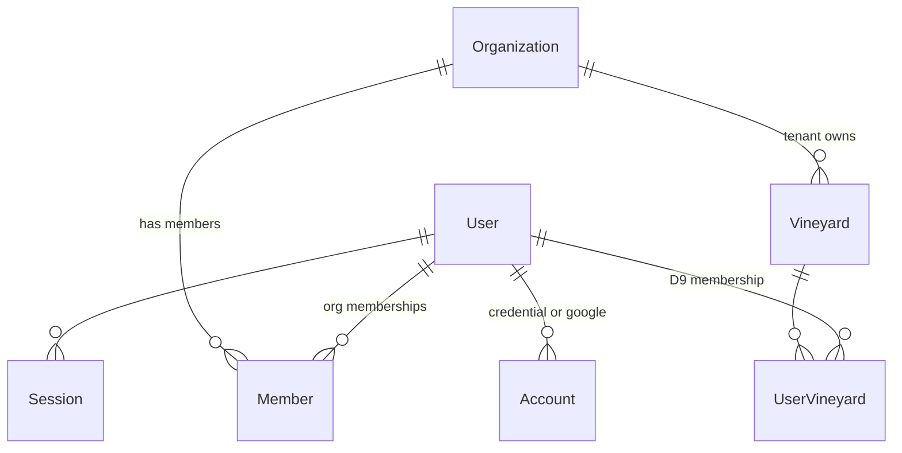
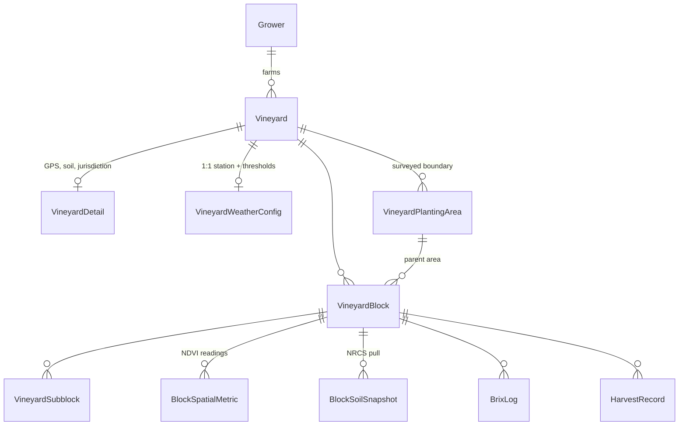
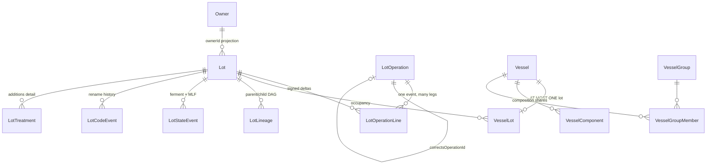
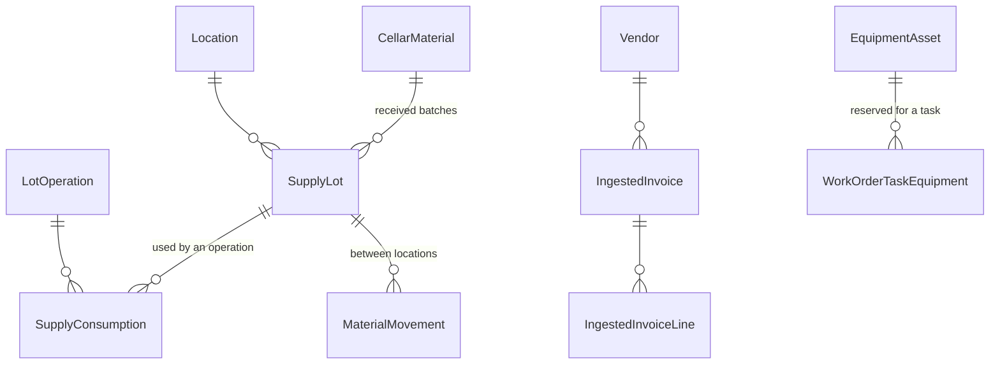
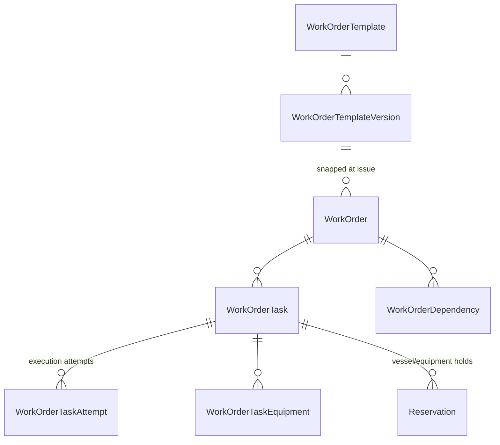
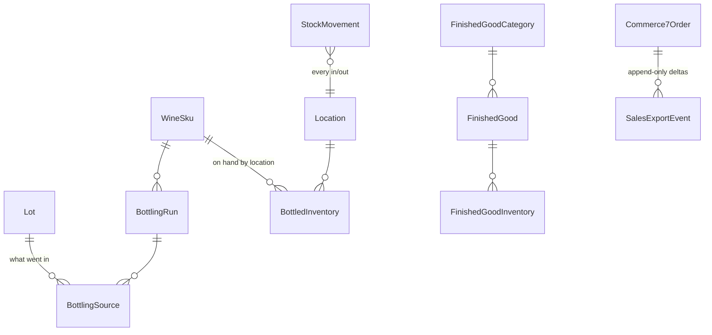

# Data model — a map of what actually exists

> **What this is:** a map of the 188 tables in `prisma/schema.prisma` and how they hang together.
> Grounded in the real schema, not in intent. When it drifts, ask Claude: *"Read prisma/schema.prisma
> and refresh docs/architecture/data-model.md."*
>
> **What this is NOT:** [[data_model_coalescence]] is the *normative* doc — where our shapes should
> align with Vintrace + InnoVint and where we deliberately diverge. Read that before **changing** a
> domain model. Read this one to find out **what is there today**.
>
> Related: [[system-map]] (how the code is organized), [[security-register]], [[scale-register]],
> [[INVARIANTS]].

## The one rule that shapes everything

**158 of 188 tables are tenant-scoped. 30 are global.** The global set is the denylist in
`src/lib/tenant/models.ts`, and it is the only place a table escapes tenant isolation:

| Group | Tables | Why global |
|---|---|---|
| Auth + org (7) | `User` `Session` `Account` `Verification` `Organization` `Member` `Invitation` | Better Auth queries these **during login**, before any tenant exists. Forcing them through tenant context would break authentication. |
| FX reference (1) | `FxRate` | ECB rates are identical for every winery. |
| Knowledge corpus (7) | `KnowledgeSource` `TrustedDomain` `CandidateSource` `KnowledgeBlob` `KnowledgeDocument` `KnowledgeUrlObservation` `KnowledgeChunk` | A crawled library of public winemaking sources. Per-winery control is `KnowledgeSourceSubscription`, which **is** tenant-scoped. |
| Pesticide registry (15) | `Pesticide*` | US EPA + CA DPR registrations are identical for every winery. Entitlement is enforced in the service layer, not by RLS. |

Everything else carries `tenantId String @default("")` + `@@index([tenantId])` + a FK to
`organization(id)` + `ENABLE`/`FORCE ROW LEVEL SECURITY` with a fail-closed `tenant_isolation` policy.

**`Organization` IS the tenant.** There is no separate `Tenant` table — a winery is an org row, and
`tenantId` is an org id.

The app connects as **`app_rls`** (`NOBYPASSRLS`), so Postgres enforces this rather than the app
remembering to. `runAsSystem()` is the owner-role escape hatch, for audited scripts only.

> ⚠️ Adding a tenant-scoped table has a **9-step checklist** in `AGENTS.md` (column, migration,
> backfill, per-tenant uniques, composite FKs, RLS policy, denylist, grants, isolation test). Skipping
> a step yields either a leak or a silently-empty table.

---

## 1. Identity and access

Three **independent** layers. A user needs all three to act on a vineyard row.

| Layer | Table / column | Question it answers |
|---|---|---|
| Tenant | `Member` (global) | Which **wineries** can you reach? |
| Role | `User.role` — `user` / `admin` / `developer` | What **powers** do you have? ([[GLOBAL-1-global-catalog-is-admin-only]]) |
| Land | `UserVineyard` (tenant-scoped) | Which **vineyards** can you touch? ([[VINEYARD-1-vineyard-membership-fence]]) |

**The trap here has already fired once.** `UserVineyard` is tenant-scoped but `User` is global, so
selecting it as a relation off `User` reads with `app.tenant_id` unset and returns **zero rows,
silently**. That emptied `AppUser.vineyardIds` for every user. It must be loaded as a separate scoped
query — `src/lib/users/vineyard-memberships.ts`. See [[security-register]] (2026-07-26).

---

## 2. The land

- `VineyardPlantingArea` holds the canonical GeoJSON plus a **`geometryFingerprint`** — a
  frame-pinned hash that is the staleness key shared with soil and NDVI. Change the geometry, the
  fingerprint changes, derived data is known-stale.
- `VineyardBlock.polygon` is the block's own analysis boundary; spacing-based acreage (not polygon
  area) remains the productive-area authority.
- Weather/forecast series (`VineyardClimateDaily`, `VineyardForecastDaily/Hourly`) hang off the
  vineyard, keyed by `providerKey` so multiple sources coexist and one is "primary".

---

## 3. The cellar — vessels, lots, and the ledger

This is the spine. Everything else is a satellite.

### Two projections of "what's in the tank"

| Table | Answers | Enforcement |
|---|---|---|
| `VesselLot` | *Which lot, how much* | `(tenantId, vesselId)` **unique** → a vessel holds **at most one lot**; a lot may occupy many vessels ([[LEDGER-12-one-lot-per-vessel]]) |
| `VesselComponent` | *Which variety / vineyard / vintage shares* | Folded through lineage by `composeLeaves`, so even an origin-less blend lot is attributed |

Both are **maintained projections with exactly one write site** (`runLedgerWrite` in
`src/lib/ledger/write.ts`). Nothing else may write them. That single chokepoint is what makes the
one-lot-per-vessel guard enforceable in one place.

### Append-only, always

- An action is a `LotOperation` (`RACK`, `CRUSH`, `PRESS`, `ADDITION`, `TOPPING`, `BLEND`, `BOTTLE`,
  `CHANGE_OWNERSHIP`, …) with one or more `LotOperationLine` legs carrying a **signed `deltaL`** and a
  `CHECK(deltaL <> 0)` — no no-op lines.
- Nothing is edited or deleted. A **correction is a new operation** pointing back via
  `correctsOperationId` (`@unique`, so one correction per op). Undo is `reverseOperationCore`, LIFO —
  the same path a work-order rejection takes.
- `LotLineage` is a **DAG**, not a tree: `parentLotId` → `childLotId` with a `fraction` and
  `kind = SPLIT | BLEND | TOPPING`.

### Identity vs label — the moat

| Column | Mutable? | Role |
|---|---|---|
| `Lot.id` | no | The **only** identity. Every FK, lineage edge, cost row and ledger line joins on this. |
| `Lot.code` | **yes** (unique per tenant) | Human label. |
| `Lot.displayName` | **yes** (non-unique) | Free-text label; presented as `displayName ?? code`. |

Renaming appends a `LotCodeEvent` and **never rewrites the snapshots** on historical
`LotOperationLine` rows. A 2023 record still shows what that lot was called in 2023
([[NAMING-1-identity-is-id]]).

---

## 4. Inputs — materials and equipment

- `CellarMaterial` is the **catalog**; `kind` is load-bearing for cost and dosing
  (`YEAST | MLF | SO2 | NUTRIENT | ACID | FINING | BENTONITE | ENZYME | CLEANING | PACKAGING | …`).
- `SupplyLot` is a **received batch** with `qtyReceived` / `qtyRemaining` and `unitCost` **always in
  the tenant base currency** — a foreign invoice is converted at receipt and never revalued. Foreign
  figures are retained alongside for audit ([[COST-4-inventory-cost-in-base-currency]]).
- `EquipmentAsset` covers presses, filters, pumps — `status` is
  `available | in_use | maintenance | retired`.

---

## 5. Work orders — the human process layer

- Sequencing uses a **positional `groupSeq`**, not a dependency-edge table: tasks in the same group
  run in parallel, and a task may complete only once every **lower** group is worker-complete. That
  keeps reject/reissue safe without maintaining edges.
- The template **version** is snapped onto the order at issue and is immutable thereafter.
- Completing an `OPERATION` task builds the **same core input** a manual server action would, so there
  is one write path rather than two — and the ledger op, the `WorkOrderTaskAttempt`, the reservation
  release and the audit row all land in **one transaction**.

---

## 6. Outbound — bottling, finished goods, sales

`Commerce7Order` is a **mutable projection** of a DTC order; the append-only truth is
`SalesExportEvent` deltas keyed `sale:{orderId}:v{seq}`. Orders change, so a single immutable snapshot
would be wrong. The projection is deliberately **PII-free** — a schema test fails if a PII column is
ever added.

---

## 7. Compliance, cost, audit

| Cluster | Tables | Note |
|---|---|---|
| Compliance | `ComplianceReport` `ComplianceProfile` `Bond` `ChangeOfTaxClassEvent` | **One** table backs both TTB forms; every query is `formType`-scoped via `compliance/form-type.ts` or the two filing chains cross ([[COMPLIANCE-1-formtype-scoped-queries]]). |
| Cost | `CostLine` `LotCostState` `OperationCostTransfer` `BottlingCostSnapshot` `CostVarianceEvent` `BarrelAsset` `BarrelFill` | Cost is conserved across every operation ([[COST-1-cost-conservation]]); a bottling snapshot is immutable ([[COST-3-immutable-cogs-snapshot]]). |
| Audit | `AuditLog` | Written **inside the same transaction** as the mutation, never after. |
| Assistant | `AssistantConversation` `AssistantMessage` `AssistantToolCall` `AssistantConfirmation` | Tool dispatches are persisted in message metadata, so measuring tool use is a query, not a migration. |

---

## Cross-cutting patterns

These recur everywhere and explain most of the schema's odd corners.

**1. Snapshot columns freeze history.** `LotOperationLine.lotCode` / `.vesselCode`,
`SprayBlockLine.blockLabelSnapshot`, `SprayMaterialLine.snapshotRainfastHours`. A historical record
carries what things were *called and known to be* at the time, so relabeling or a data-source update
can't rewrite the past.

**2. Composite foreign keys in raw SQL — and therefore no Prisma relation.** Cross-tenant-risk FKs are
`(tenantId, refId) → (tenantId, id)` composites, hand-written in migrations because Prisma cannot
express them. Consequence: **`SprayApplication`, `SprayBlockLine`, `SpatialStyle`, `SprayDryingOverride`
declare no `@relation` at all.** A nested `select: { application: … }` does not compile — those joins
must be scalar lookups. This is the single most surprising thing in the schema.

The graph is no longer invisible: `prisma/fk-registry.json` holds all **435** constraints (337 composite,
98 simple), replayed from the migration history and proven against `pg_constraint` in CI. See
[[FK-1-every-foreign-key-is-declared]]. Of 494 reference columns: 118 via Prisma relation, 291 via
composite constraint, 78 deliberate soft references, 11 individually allowed, **85 on a shrink-only
backlog**:

| Group | Count | Disposition |
|---|---|---|
| Reversal / supersede self-references (`reversalOf…Id`, `supersedes…Id`) | ~10 | Self-table, so a composite FK **is** possible — likely genuine omissions |
| Pesticide revision pointers (`revisionId`, `lastSeenRevisionId`) | 9 | Global→global, a simple FK is possible |
| Denormalised `vineyardId` on `BlockSpatialMetric` / `BlockSoilSnapshot` / `SpatialDatasetDerivative` | 3 | The block already implies the vineyard, so these can **silently drift** from it — a real integrity risk, not just a missing constraint |
| `Lot.origin{Vineyard,Block,Subblock,Variety}Id` | 4 | **Needs a product decision** — forgotten constraints, or deliberate snapshots that must outlive a deleted vineyard |
| Polymorphic subjects (`sourceId`, `subjectId`, `targetId`) | ~8 | Cannot be constrained; move to soft references |
| Migration/import staging, misc | ~50 | Mostly external legacy ids; triage per table |

**3. Maintained projections, single write site.** `VesselLot`, `VesselComponent`, `Lot.ownerId`,
`LotCostState`. Each is derived state stored for speed, with exactly one function permitted to fold
it. `ownerId` in particular is **never re-walked from lineage** — re-deriving would resurrect a
pre-change owner ([[OWNER-1-owner-projection]]).

**4. Counters for gap-free human numbers.** `WeighTagCounter`, `WorkOrder.number`. Regulatory
documents need monotonic, gap-free numbering, so they get a row-locked counter and **void-not-delete**.

**5. Events over status flags.** `LotStateEvent`, `LotCodeEvent`, `VesselActivityEvent`,
`PlannedHarvestDateEvent`, `CostVarianceEvent`, `LatentInfectionEvent`. When *when-and-why* matters,
the schema stores an event stream rather than a mutable column.

---

## The invariants that pin this shape

`INVARIANTS.md` is the narrative; `docs/architecture/invariants/` is the machine-readable register.
`npm run verify:invariants` asserts every one names a live guard — **but it never runs them**, so a
guard pointed at an unrelated green script would pass while proving nothing.

The data-model-shaping ones:

| Invariant | In one line | Guard |
|---|---|---|
| TENANT-1 | Every domain table is RLS-isolated, fail-closed | `verify:tenant-isolation` |
| LEDGER-12 | A vessel holds at most one lot | `verify:one-lot-per-vessel` |
| LEDGER-1/2 | Volumes stay positive; no no-op lines | `verify:reverse` |
| NAMING-1/2 | `Lot.id` is identity; `code` is a mutable label | `verify:naming` |
| OWNER-1 | `ownerId` is a maintained projection, never re-derived | `verify:owner-model` |
| COST-1 | Cost is conserved across operations | `verify:cost` |
| COMPLIANCE-1 | Every report query is `formType`-scoped | `verify:excise` |
| INBOX-1 | Per-user RLS on notifications and DMs | `verify:inbox-isolation` |
| VINEYARD-1 | Every vineyard-scoped action applies D9 | `verify:vineyard-scope` (+ `-db`) |
| GLOBAL-1 | Tenant-global catalog writes are admin-only | `verify:global-catalog-admin` |

---

## Known gaps

- **No owner-scope RLS.** `ownerId` exists on ~25 tables as a data model only. Intra-tenant isolation
  between custom-crush clients is **plan 092 / Phase 23** (capability matrix + a RESTRICTIVE RLS quad).
  Until it lands there is no client-facing read path, and VINEYARD-1 / GLOBAL-1 are app-layer fences
  with zero DB enforcement.
- **85 reference columns carry no constraint** — the shrink-only `prisma/fk-baseline.json`, guarded by
  [[FK-1-every-foreign-key-is-declared]]. Triage table above.
- **`GLOBAL_MODELS` is mirrored in three places** — `src/lib/tenant/models.ts`,
  `scripts/verify-tenant-isolation.ts`, `test/tenant-context.test.ts`. Drift fails loudly (the RLS
  coverage guard demands RLS on a table it thinks is tenant-scoped), but it is 30 hand-synced strings.
- **`CellarMaterial.subcategory`** is a dormant column, retired from the UI in Phase 036 and kept only
  to avoid a migration.
