# Entity-relationship diagrams

> **Generated — do not edit.** `npm run docs:data-dictionary` rebuilds this. Column detail:
> [[data-dictionary]].

**188 tables · 439 foreign keys**, of which **183 are composite**
`(tenantId, refId) → (tenantId, id)` — the shape that makes a cross-tenant reference structurally
impossible. Prisma cannot express those, so they are absent from Prisma Studio; they are real
`pg_constraint` rows and appear below.

One diagram per domain, because 188 tables in a single graph is unreadable. An edge to a table
outside the current domain is still drawn — that is where the seams are.

⚠️ **The universal `tenantId → organization` edge is omitted from the pictures.** All 188 tables
carry it (158 constraints), so drawing it conveys nothing and turns `organization` into a hub that
flattens every layout. It is still listed per table in [[data-dictionary]] — omitted from the
picture, not from the record.

## Identity & access

_Who can sign in, which winery they belong to, and what they may reach._

12 tables · 10 outgoing references

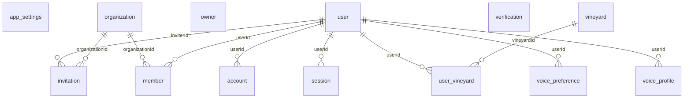

## Weather & climate

_Observed and forecast weather per vineyard, plus provider quota tracking._

6 tables · 5 outgoing references

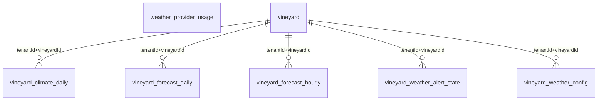

## Spray & pest

_The pesticide corpus, tenant product facts, and the append-only spray chain._

24 tables · 26 outgoing references

```mermaid
erDiagram
  latent_infection_event
  legacy_spray_mapping
  pesticide_active_ingredient
  pesticide_data_revision
  pesticide_pest_category
  pesticide_product
  pesticide_product_condition
  pesticide_product_facts
  pesticide_product_ingredient
  pesticide_product_pest
  pesticide_product_phi_condition
  pesticide_product_rei_condition
  pesticide_resistance_assignment
  pesticide_separation_rule
  pesticide_site_registration
  pesticide_state_registration
  pesticide_use_restriction
  planned_harvest_date_event
  spray_application
  spray_block_line
  spray_drying_override
  spray_material_line
  spray_mix_order_line
  tenant_product_facts
  vineyard_block ||--o{ latent_infection_event : "tenantId+blockId"
  latent_infection_event ||--o{ latent_infection_event : "tenantId+reversesRowId"
  latent_infection_event ||--o{ latent_infection_event : "tenantId+supersedesRowId"
  pesticide_active_ingredient ||--o{ pesticide_active_ingredient : "parentActiveIngredientId"
  pesticide_product_facts ||--o{ pesticide_product_condition : "factsId"
  pesticide_active_ingredient ||--o{ pesticide_product_ingredient : "activeIngredientId"
  pesticide_product ||--o{ pesticide_product_ingredient : "productId"
  pesticide_pest_category ||--o{ pesticide_product_pest : "pestCode"
  pesticide_product_facts ||--o{ pesticide_product_phi_condition : "factsId"
  pesticide_product_facts ||--o{ pesticide_product_rei_condition : "factsId"
  pesticide_active_ingredient ||--o{ pesticide_resistance_assignment : "activeIngredientId"
  pesticide_product ||--o{ pesticide_resistance_assignment : "productId"
  pesticide_product_facts ||--o{ pesticide_separation_rule : "factsId"
  pesticide_product ||--o{ pesticide_site_registration : "productId"
  pesticide_product ||--o{ pesticide_state_registration : "productId"
  pesticide_product ||--o{ pesticide_use_restriction : "productId"
  vineyard_block ||--o{ planned_harvest_date_event : "tenantId+blockId"
  spray_application ||--o{ spray_application : "tenantId+supersededByApplicationId"
  spray_application ||--o{ spray_application : "tenantId+supersedesApplicationId"
  vineyard ||--o{ spray_application : "tenantId+vineyardId"
  spray_application ||--o{ spray_block_line : "tenantId+applicationId"
  vineyard_block ||--o{ spray_block_line : "tenantId+blockId"
  spray_block_line ||--o{ spray_drying_override : "tenantId+blockLineId"
  spray_application ||--o{ spray_material_line : "tenantId+applicationId"
  spray_application ||--o{ spray_mix_order_line : "tenantId+applicationId"
  spray_material_line ||--o{ spray_mix_order_line : "tenantId+applicationId+materialLineId"
```

## The land

_Vineyards, blocks, plantings, and the geospatial layers over them._

20 tables · 21 outgoing references

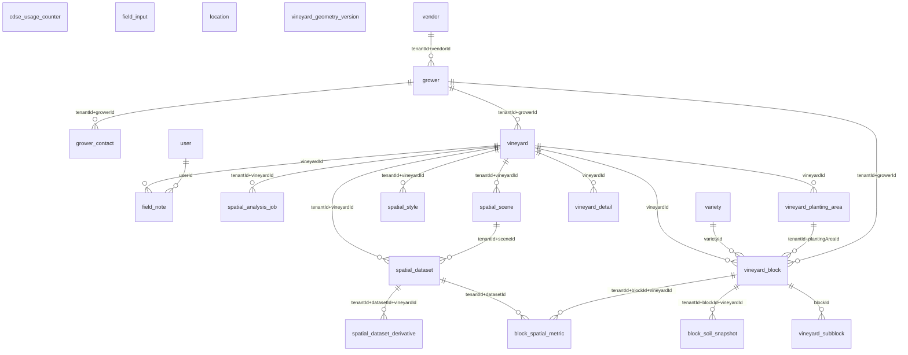

## Harvest

_Picks, weigh tags, and Brix readings coming off the vineyard._

6 tables · 10 outgoing references

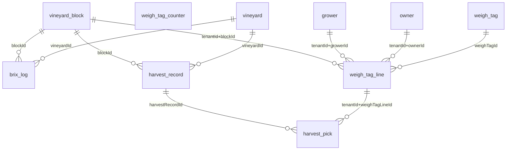

## Vendors & ingest

_Vendors and the invoice/document ingestion staging tables._

8 tables · 14 outgoing references

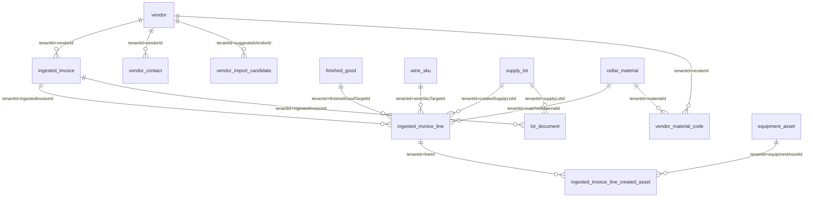

## Lots & the operation ledger

_THE CORE. A lot is identity; its volume is the FOLD of an append-only operation ledger. vessel_lot and lot_vineyard are maintained projections, not source of truth._

15 tables · 38 outgoing references

```mermaid
erDiagram
  lot
  lot_code_event
  lot_cost_state
  lot_harvest_source
  lot_identifier
  lot_lineage
  lot_operation
  lot_operation_line
  lot_state_event
  lot_tasting_note
  lot_treatment
  lot_vineyard
  naming_template
  naming_template_version
  vessel_lot
  owner ||--o{ lot : "tenantId+ownerId"
  owner ||--o{ lot_code_event : "tenantId+ownerId"
  lot ||--o{ lot_code_event : "tenantId+lotId"
  lot ||--o{ lot_cost_state : "tenantId+lotId"
  owner ||--o{ lot_harvest_source : "tenantId+ownerId"
  harvest_pick ||--o{ lot_harvest_source : "tenantId+harvestPickId"
  lot ||--o{ lot_harvest_source : "tenantId+lotId"
  owner ||--o{ lot_identifier : "tenantId+ownerId"
  lot ||--o{ lot_identifier : "tenantId+lotId"
  lot ||--o{ lot_lineage : "tenantId+childLotId"
  lot ||--o{ lot_lineage : "tenantId+parentLotId"
  lot_operation ||--o{ lot_operation : "correctsOperationId"
  lot_operation ||--o{ lot_operation_line : "operationId"
  owner ||--o{ lot_operation_line : "tenantId+ownerId"
  bond ||--o{ lot_operation_line : "tenantId+destBondId"
  lot ||--o{ lot_operation_line : "tenantId+lotId"
  bond ||--o{ lot_operation_line : "tenantId+sourceBondId"
  vessel ||--o{ lot_operation_line : "tenantId+vesselId"
  lot ||--o{ lot_state_event : "lotId"
  lot_operation ||--o{ lot_state_event : "operationId"
  owner ||--o{ lot_state_event : "tenantId+ownerId"
  vessel ||--o{ lot_state_event : "vesselId"
  lot ||--o{ lot_tasting_note : "lotId"
  owner ||--o{ lot_tasting_note : "tenantId+ownerId"
  vessel ||--o{ lot_tasting_note : "vesselId"
  lot ||--o{ lot_treatment : "lotId"
  cellar_material ||--o{ lot_treatment : "materialId"
  lot_operation ||--o{ lot_treatment : "operationId"
  owner ||--o{ lot_treatment : "tenantId+ownerId"
  vessel ||--o{ lot_treatment : "vesselId"
  lot_operation ||--o{ lot_treatment : "voidedByOperationId"
  owner ||--o{ lot_vineyard : "tenantId+ownerId"
  lot ||--o{ lot_vineyard : "tenantId+lotId"
  vineyard ||--o{ lot_vineyard : "tenantId+vineyardId"
  naming_template ||--o{ naming_template_version : "tenantId+templateId"
  owner ||--o{ vessel_lot : "tenantId+ownerId"
  lot ||--o{ vessel_lot : "tenantId+lotId"
  vessel ||--o{ vessel_lot : "tenantId+vesselId"
```

## Vessels, analysis & trials

_Tanks and barrels, what is dissolved in them, lab readings, and blend trials._

14 tables · 30 outgoing references

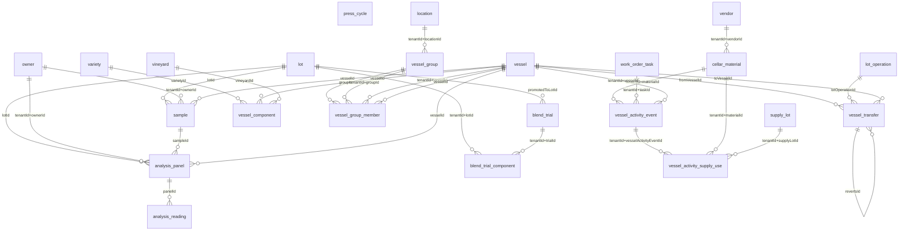

## Materials & equipment

_Consumables, supply lots, barrels, and tracked equipment assets._

8 tables · 19 outgoing references

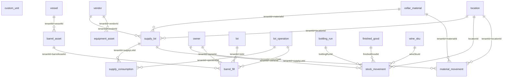

## Work orders

_The human process layer — tasks, attempts, templates, reservations._

11 tables · 21 outgoing references

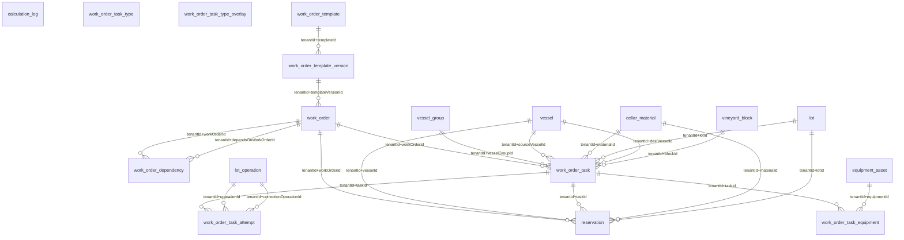

## Bottling & finished goods

_Bottling runs, SKUs, and finished-goods inventory._

10 tables · 26 outgoing references

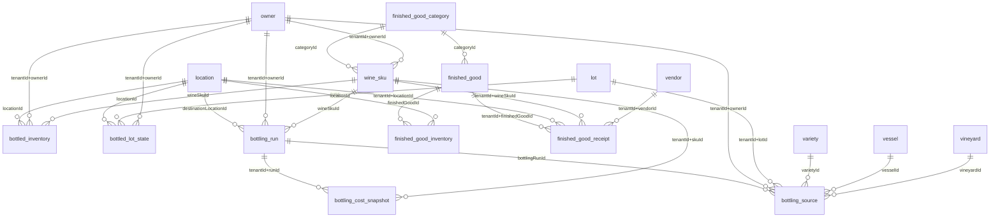

## Cost & accounting

_Cost roll-up, variance, A/P export, FX, and the accounting connection._

15 tables · 17 outgoing references

```mermaid
erDiagram
  account_mapping
  accounting_connection
  accounting_delivery
  ap_export_event
  billable_wine_consumed
  commerce7_connection
  commerce7_install_state
  commerce7_order
  commerce7_sku_map
  cost_export_event
  cost_line
  cost_variance_event
  fx_rate
  operation_cost_transfer
  sales_export_event
  ap_export_event ||--o{ accounting_delivery : "tenantId+apExportEventId"
  accounting_connection ||--o{ accounting_delivery : "tenantId+connectionId"
  cost_export_event ||--o{ accounting_delivery : "tenantId+costExportEventId"
  sales_export_event ||--o{ accounting_delivery : "tenantId+salesExportEventId"
  vendor ||--o{ ap_export_event : "tenantId+vendorId"
  owner ||--o{ billable_wine_consumed : "tenantId+consumedOwnerId"
  lot ||--o{ billable_wine_consumed : "tenantId+sourceLotId"
  lot_operation ||--o{ billable_wine_consumed : "operationId"
  owner ||--o{ billable_wine_consumed : "tenantId+receivingOwnerId"
  wine_sku ||--o{ commerce7_sku_map : "tenantId+wineSkuId"
  owner ||--o{ cost_line : "tenantId+ownerId"
  lot ||--o{ cost_line : "tenantId+lotId"
  lot_operation ||--o{ cost_line : "tenantId+operationId"
  bottling_cost_snapshot ||--o{ cost_variance_event : "tenantId+snapshotId"
  lot ||--o{ operation_cost_transfer : "tenantId+fromLotId"
  lot_operation ||--o{ operation_cost_transfer : "tenantId+operationId"
  lot ||--o{ operation_cost_transfer : "tenantId+toLotId"
```

## Compliance & tax

_TTB reporting, bond isolation, tax class, and reminders._

6 tables · 5 outgoing references

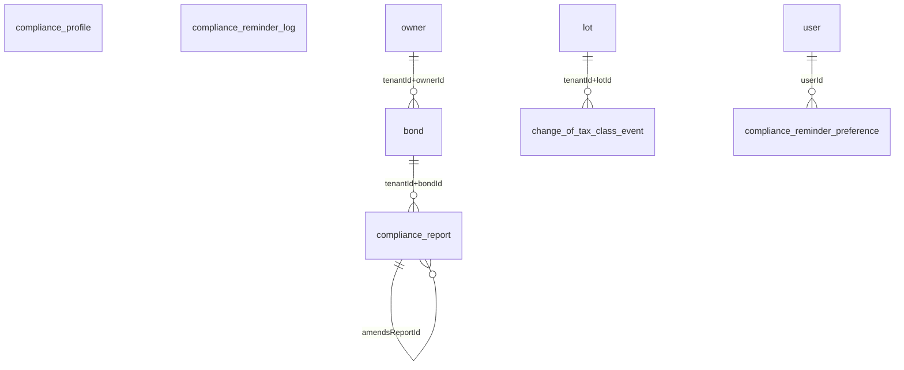

## Assistant & feedback

_The AI assistant's conversations, confirmations, and the feedback loop._

10 tables · 10 outgoing references

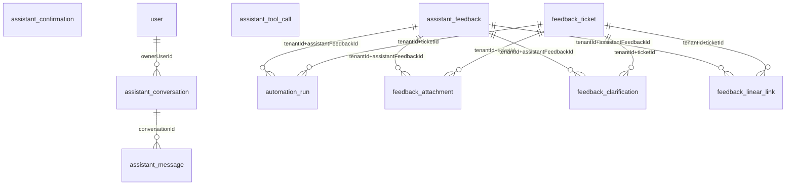

## Knowledge base

_The crawled corpus behind the assistant's domain answers._

9 tables · 5 outgoing references

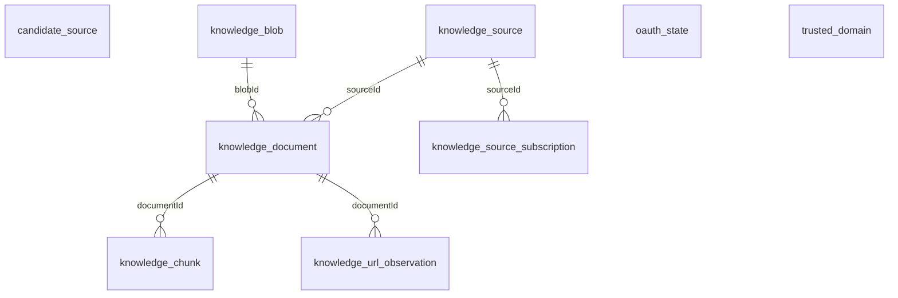

## Inbox

_Per-user notifications and direct messages. NOTE: per-USER row security on top of per-tenant — a tenant-only read returns zero rows._

4 tables · 8 outgoing references

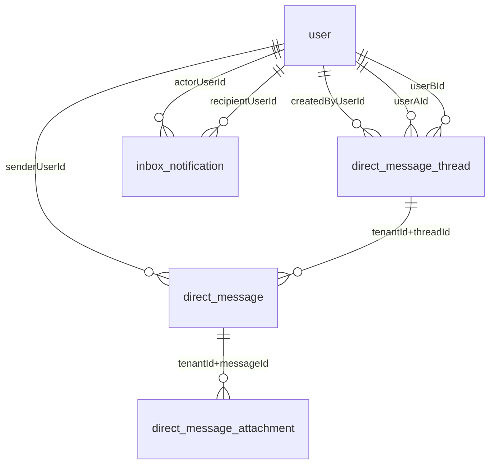

## Migration & audit

_Cutover import staging and the immutable audit log._

10 tables · 16 outgoing references

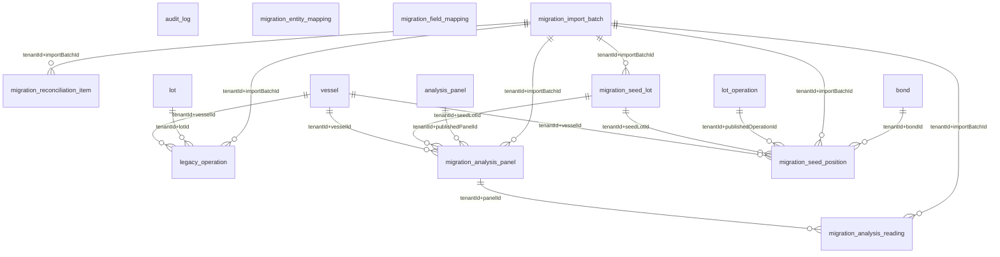

